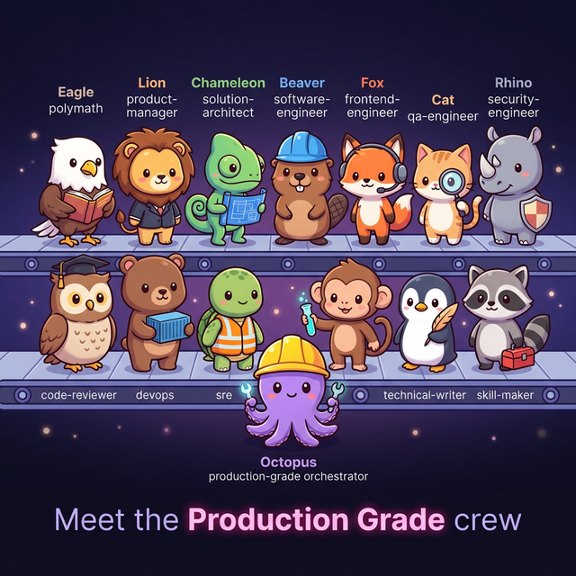

# Production Grade Plugin for Claude Code

<p align="center">
  
</p>

[](https://github.com/nagisanzenin/claude-code-production-grade-plugin)
[](https://opensource.org/licenses/MIT)
[]()
[]()
[]()
[]()

**14 skills for all software engineering work. Not just greenfield builds.**

Build a complete SaaS from scratch, add a feature to existing code, harden before launch, set up CI/CD, write tests, review code quality — the orchestrator routes to the right skills automatically.

> **v4.4** — Freshness protocol. All 14 agents now detect volatile data (model IDs, package versions, pricing, CVEs, framework APIs) and WebSearch to verify before implementing. No more outdated `gpt-4-turbo`, wrong Docker tags, or stale SDK syntax.

### Release Timeline

```
2026-03-06  v4.4  ●━━━ Freshness protocol — agents WebSearch to verify volatile data before implementing
                  │
2026-03-06  v4.3  ●━━━ Visual identity, observability, pipeline dashboard, gate ceremonies
                  │
2026-03-06  v4.2  ●━━━ Adaptive routing, 10 execution modes, everyday SWE work
                  │
2026-03-05  v4.1  ●━━━ Engagement modes, scale-driven architecture, adaptive interviews
                  │
2026-03-04  v4.0  ●━━━ Two-wave parallelism, internal skill agents, dynamic task generation
                  │
2026-03-04  v3.3  ●━━━ Brownfield-safe — works on existing codebases
                  │
2026-03-03  v3.2  ●━━━ Auto-update, MECE intent routing, protocol crash fix
                  │
2026-03-02  v3.1  ●━━━ Polymath co-pilot — the 14th skill
                  │
2026-03-01  v3.0  ●━━━ Full rewrite — Teams/TaskList, 7 parallel points, shared protocols
                  │
2026-02-28  v2.0  ●━━━ 13 bundled skills, unified workspace, prescriptive UX
                  │
2026-02-24  v1.0  ●━━━ Initial release — autonomous DEFINE>BUILD>HARDEN>SHIP>SUSTAIN
```

### Quick Start

```bash
/plugin marketplace add nagisanzenin/claude-code-plugins
/plugin install production-grade@nagisanzenin
```

Then say: *"Build a production-grade SaaS for [your idea]"* — or *"Help me think about [your idea]"* if you want the Polymath co-pilot first.

---

## Why This Exists

Software development with AI today is broken in a specific way: **AI is fast at generating code, but slow at understanding what to generate.** You prompt, you get code, it's wrong, you re-prompt, you get different wrong code. The bottleneck isn't generation — it's alignment.

Traditional AI coding tools assume you arrive with perfect clarity: the right architecture, the right tech stack, the right requirements. Most users don't. They have a fuzzy idea, knowledge gaps, and no way to tell the AI what it needs to know.

**Production Grade solves both sides:**
1. A **Polymath co-pilot** that thinks with you — researches your domain, detects your knowledge gaps, helps you crystallize the idea before committing to code
2. A **14-agent autonomous pipeline** that executes the full software development lifecycle — from requirements to deployment — without you managing the process

The result: you describe what you want in plain language. 14 specialized agents research, design, build, test, secure, deploy, and document a complete production system. You approve 3 times. That's it.

### By the Numbers

| Metric | Detail |
|--------|--------|
| **14 specialized agents** | Each with sole authority over its domain — no overlap, no contradiction |
| **10+ parallel execution points** | Two-wave orchestration + internal skill parallelism |
| **3 approval gates** | Everything between gates is fully autonomous |
| **~3x faster execution** | Two-wave parallel: analysis starts alongside build, not after |
| **~45% fewer total tokens** | Parallel agents carry minimal context vs. sequential accumulation |
| **Dynamic task generation** | Orchestrator reads architecture output, spawns 1 agent per service/page |
| **4 shared protocols** | UX, input validation, tool efficiency, conflict resolution |
| **6 Polymath modes** | Onboard, research, ideate, advise, translate, synthesize |
| **4 engagement modes** | Express, Standard, Thorough, Meticulous — choose your interaction depth |
| **0 open-ended questions** | Every user interaction is structured: arrow keys + Enter |

### What Makes This Unique

**A co-pilot that thinks with you, not just for you.** The Polymath researches your domain via live web search before you answer a single question. It detects knowledge gaps in your request and fills them. No other plugin has a dedicated thinking partner that bridges the gap between "I have an idea" and "I know exactly what to build."

**Full-lifecycle coverage in a single install.** Requirements, architecture, backend, frontend, testing, security audit, code review, infrastructure, CI/CD, SRE readiness, documentation, and custom skill generation — all coordinated through a dependency graph with parallel execution. Most plugins cover one or two of these steps.

**Non-technical users can drive the entire pipeline.** Every interaction is multiple choice. At every approval gate, "Chat about this" invokes the Polymath to explain technical decisions in plain language. You don't need to understand "modular monolith with row-level multi-tenancy" — the Polymath translates it to *"one building with separate rooms, each customer's data in its own locked drawer."*

**Architecture derived from YOUR constraints, not a template.** There is no one-size-fits-all architecture. The Solution Architect conducts a scale and fitness interview — users, CCU, budget, team size, compliance, data patterns — and derives the right architecture pattern, infrastructure sizing, and data strategy. A 100-user internal tool gets a monolith with managed services. A 10M-user global platform gets microservices with multi-region deployment. The architecture fits the problem.

**Authority hierarchy eliminates conflicts.** When 14 agents work on the same codebase, overlapping outputs create chaos. Production Grade solves this with sole-authority domains: security-engineer owns OWASP (code-reviewer must not do security review), SRE owns SLOs (devops must not define them), and findings are deduplicated by file:line with highest severity kept.

**Adjustable interaction depth — from hands-off to full control.** At pipeline start, choose your engagement mode: Express (minimal interaction, auto-derive everything), Standard (balanced), Thorough (deep capacity planning, architecture trade-off analysis), or Meticulous (approve each decision individually, full walkthrough). Non-technical founders use Express. Senior architects use Meticulous. Everyone gets the right depth.

**Adapts to your project, not the other way around.** API-only project? Frontend is auto-skipped. Using LLM APIs? Data scientist auto-activates. Existing codebase? `.production-grade.yaml` maps to your directory structure. The pipeline shapes itself to the problem.

---

## The Polymath — Your Co-Pilot

The 14th skill, and the one that changes everything. Every other skill executes. The Polymath *thinks with you*.

**Before the pipeline:** Researches your domain, analyzes competitors, helps you crystallize a fuzzy idea into a clear vision. You don't need to know the right tech terms — the Polymath translates.

**During the pipeline:** When you hit an approval gate and see "modular monolith with row-level multi-tenancy" — select "Chat about this" and the Polymath explains: *"One building with separate rooms. Each customer's data in its own locked drawer."*

**Outside the pipeline:** Onboard on an unfamiliar codebase. Compare tech stacks. Analyze build-vs-buy decisions. Prepare a technical proposal. The Polymath handles any intellectual work where understanding must come before action.

**Every interaction is structured:** Arrow keys to navigate, Enter to select. The Polymath anticipates what you'll want to ask and offers it as an option. "Chat about this" is always available for free-form input.

---

## How It Works

```
DEFINE → BUILD → HARDEN → SHIP → SUSTAIN
```

You give a high-level vision. 14 specialized agents handle everything else.

### The Pipeline

```
Polymath (pre-flight: research, gap detection, context building)
    ↓
T1: Product Manager (BRD) ──────────────── GATE 1: approve requirements
T2: Solution Architect ─────────────────── GATE 2: approve architecture
    ↓
┌── WAVE A: BUILD + ANALYSIS (all parallel) ──────────────────────┐
│  T3a: Backend ────── spawns N agents (1 per service)            │
│  T3b: Frontend ───── spawns N agents (1 per page group)         │
│  T4a: DevOps ─────── Dockerfiles + CI skeleton                  │
│  T5a: QA ─────────── test plan from BRD + architecture          │
│  T6a: Security ───── STRIDE threat model                        │
│  T6b: Code Review ── arch conformance checklist                 │
│  T9a: SRE ────────── SLO definitions                            │
└─────────────────────────────────────────────────────────────────┘
    ↓ (code written)
┌── WAVE B: EXECUTION against code (all parallel) ───────────────┐
│  T4b: DevOps ─────── build + push containers                    │
│  T5b: QA ─────────── implement tests (parallel: unit/e2e/perf)  │
│  T6c: Security ───── code audit + dep scan (parallel phases)    │
│  T6d: Code Review ── actual review (parallel: arch/quality/perf)│
└─────────────────────────────────────────────────────────────────┘
    ↓
T7: DevOps (IaC + CI/CD) ──┐
T8: Remediation ────────────┘ PARALLEL
T9b: SRE (chaos + capacity) ┐
T10: Data Scientist ─────────┘ PARALLEL
    ↓ ─────────────────────────── GATE 3: approve production readiness
T11: Technical Writer (parallel: API ref + dev guides) ──┐
T12: Skill Maker ────────────────────────────────────────┘ PARALLEL
T13: Compound Learning
```

**3 approval gates. Two-wave execution. Internal skill parallelism. Maximum concurrency.**

### Interaction Model

You never need to type. Arrow keys + Enter for every decision.

```
> Approve — start building (Recommended)
  Show architecture details
  I have concerns
  Chat about this              ← Polymath explains in plain language
```

---

## 14 Bundled Skills

| # | Skill | Role |
|---|-------|------|
| 0 | **polymath** | Your co-pilot: research, advice, codebase onboarding, pipeline companion |
| 1 | **production-grade** | Orchestrator: coordinates entire pipeline via Teams/TaskList |
| 2 | **product-manager** | CEO interview, domain research, BRD with user stories |
| 3 | **solution-architect** | ADRs, tech stack, API contracts, data models, scaffold |
| 4 | **software-engineer** | Clean architecture backend: handlers, services, repositories |
| 5 | **frontend-engineer** | Design system, components, pages, API clients, a11y |
| 6 | **qa-engineer** | Integration, e2e, performance tests, self-healing protocol |
| 7 | **security-engineer** | STRIDE + OWASP (sole authority), PII, dependency scan |
| 8 | **code-reviewer** | Architecture conformance, quality, performance (read-only) |
| 9 | **devops** | Docker, Terraform, CI/CD, monitoring |
| 10 | **sre** | SLOs (sole authority), chaos engineering, runbooks, capacity |
| 11 | **data-scientist** | LLM optimization, A/B testing, data pipelines, cost modeling |
| 12 | **technical-writer** | API reference, dev guides, Docusaurus scaffold |
| 13 | **skill-maker** | 3-5 project-specific custom skills |

### Token-Efficient Architecture

Large skills use a router + on-demand phase pattern with internal parallelism. Only the relevant phase loads — and independent phases run as parallel Agents, each carrying minimal context.

| Skill | Phases |
|-------|--------|
| `polymath` | 6 modes: onboard, research, ideate, advise, translate, synthesize |
| `software-engineer` | 5 phases: context, implementation, cross-cutting, integration, local dev |
| `frontend-engineer` | 5 phases: analysis, design system, components, pages, testing/a11y |
| `security-engineer` | 6 phases: threat model, code audit, auth, data, supply chain, remediation |
| `sre` | 5 phases: readiness, SLOs, chaos, incidents, capacity |
| `data-scientist` | 6 phases: audit, LLM optimization, experiments, pipeline, ML infra, cost |
| `technical-writer` | 4 phases: audit, API reference, dev guides, Docusaurus |

---

## Installation

```bash
# Marketplace (recommended)
/plugin marketplace add nagisanzenin/claude-code-plugins
/plugin install production-grade@nagisanzenin

# Or load directly from source
git clone https://github.com/nagisanzenin/claude-code-production-grade-plugin.git
claude --plugin-dir /path/to/claude-code-production-grade-plugin
```

**Requirements:** Claude Code (with plugin support), Docker & Docker Compose, Git.

---

## Configuration

### Zero Config

Works out of the box. The orchestrator auto-detects your project structure and makes sensible defaults.

### Custom Config (`.production-grade.yaml`)

For existing projects or specific preferences:

```yaml
version: "3.1"

project:
  name: "my-project"
  language: "typescript"        # typescript | go | python | rust | java
  framework: "nestjs"           # nestjs | express | fastapi | gin | actix | spring
  cloud: "aws"                  # aws | gcp | azure
  architecture: "microservices" # monolith | modular-monolith | microservices

paths:
  services: "services/"
  frontend: "frontend/"
  tests: "tests/"
  terraform: "infrastructure/terraform/"
  ci_cd: ".github/workflows/"
  docs: "docs/"

preferences:
  test_framework: "jest"
  orm: "prisma"
  package_manager: "npm"
  frontend_framework: "nextjs"

features:
  frontend: true
  ai_ml: false                  # auto-detected from imports
  multi_tenancy: true
  documentation_site: true
```

---

## Partial Execution

Don't need the full pipeline? Run what you need:

| Command | What Runs |
|---------|-----------|
| `"Just define"` | PM + Architect only |
| `"Just build"` | Backend + Frontend + Containers |
| `"Just harden"` | QA + Security + Code Review |
| `"Just ship"` | IaC + CI/CD + SRE |
| `"Just document"` | Technical Writer only |
| `"Help me think about..."` | Polymath only (exploration, research, advice) |
| `"Onboard me on this repo"` | Polymath onboard mode |
| `"Skip frontend"` | Full pipeline minus frontend |

---

## Conflict Resolution

Each domain has one authority. No overlap, no contradictions.

| Domain | Authority | Others Must Not |
|--------|-----------|-----------------|
| OWASP, STRIDE, PII | **security-engineer** | code-reviewer skips security |
| SLOs, error budgets, runbooks | **sre** | devops skips SLO definitions |
| Code quality, arch conformance | **code-reviewer** | produces findings only, no code changes |
| Infrastructure, CI/CD | **devops** | sre reviews but doesn't provision |
| Requirements | **product-manager** | architect flags gaps, doesn't change requirements |
| Architecture | **solution-architect** | implementation follows, doesn't redesign |

---

## Examples

```
# Greenfield SaaS
"Build a production-grade SaaS for multi-vendor e-commerce
 with seller dashboards, buyer marketplace, and payment processing."

# AI/ML platform (data-scientist auto-activates)
"Full production pipeline for an AI content generation platform
 with prompt management, usage metering, and team workspaces."

# API-only backend (frontend auto-skipped)
"Build a production-grade REST API for a fintech lending platform.
 No frontend. Focus on security and compliance."

# Explore first, build later
"Help me think about building a restaurant management platform.
 I'm not sure what's out there or what tech to use."

# Existing project
"Onboard me on this codebase, then harden it —
 run security audit and code review."
```

---

## FAQ

**Does it write working code?**
Yes. Every agent: write, build, test, debug, fix. No stubs. No TODOs. Code that compiles and runs.

**Can I use it if I'm not technical?**
Yes. The Polymath co-pilot translates everything into plain language. Every interaction is multiple choice. You never need to know the right technical terms.

**Can I use it on existing projects?**
Yes. Create `.production-grade.yaml` to map your paths, then run specific phases or the full pipeline.

**What languages are supported?**
TypeScript/Node.js, Go, Python, Rust, Java/Kotlin.

**Will it overwrite my existing code?**
No. Deliverables go to defined directories. Agent workspace artifacts stay in `Claude-Production-Grade-Suite/`.

**How is state managed?**
Native Claude Code Teams/TaskList. No custom state files.

---

## Contributing

1. Fork the repo
2. Create a branch: `git checkout -b feature/your-feature`
3. Commit changes
4. Open a Pull Request

**Adding a skill:** Create `skills/your-skill-name/SKILL.md` with `---` frontmatter. For large skills, use the router + phases pattern.

---

## Star History

<a href="https://star-history.com/#nagisanzenin/claude-code-production-grade-plugin&Date">
 <picture>
   <source media="(prefers-color-scheme: dark)" srcset="https://api.star-history.com/svg?repos=nagisanzenin/claude-code-production-grade-plugin&type=Date&theme=dark" />
   <source media="(prefers-color-scheme: light)" srcset="https://api.star-history.com/svg?repos=nagisanzenin/claude-code-production-grade-plugin&type=Date" />
   
 </picture>
</a>

---

## License

MIT

---

<p align="center">
  <strong>From idea to production-ready SaaS. One prompt. 14 expert AI agents. Your co-pilot included.</strong>
</p>
