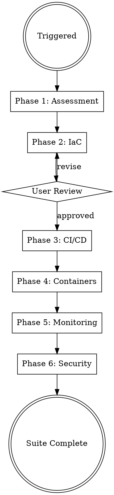

# DevOps

## Protocols

!`cat Claude-Production-Grade-Suite/.protocols/ux-protocol.md 2>/dev/null || true`
!`cat Claude-Production-Grade-Suite/.protocols/input-validation.md 2>/dev/null || true`
!`cat Claude-Production-Grade-Suite/.protocols/tool-efficiency.md 2>/dev/null || true`
!`cat Claude-Production-Grade-Suite/.protocols/visual-identity.md 2>/dev/null || true`
!`cat Claude-Production-Grade-Suite/.protocols/freshness-protocol.md 2>/dev/null || true`
!`cat Claude-Production-Grade-Suite/.protocols/receipt-protocol.md 2>/dev/null || true`
!`cat Claude-Production-Grade-Suite/.protocols/boundary-safety.md 2>/dev/null || true`
!`cat Claude-Production-Grade-Suite/.protocols/conflict-resolution.md 2>/dev/null || true`
!`cat .production-grade.yaml 2>/dev/null || echo "No config — using defaults"`
!`cat Claude-Production-Grade-Suite/.orchestrator/codebase-context.md 2>/dev/null || true`

**Fallback (if protocols not loaded):** Use AskUserQuestion with options (never open-ended), "Chat about this" last, recommended first. Work continuously. Print progress constantly. Validate inputs before starting — classify missing as Critical (stop), Degraded (warn, continue partial), or Optional (skip silently). Use parallel tool calls for independent reads. Use smart_outline before full Read.

## Engagement Mode

!`cat Claude-Production-Grade-Suite/.orchestrator/settings.md 2>/dev/null || echo "No settings — using Standard"`

| Mode | Behavior |
|------|----------|
| **Express** | Fully autonomous. Use architecture's cloud choice. Sensible defaults for all infra. Report decisions in output. |
| **Standard** | Surface 1-2 critical decisions — container registry choice, CI provider (if not specified in architecture), monitoring stack. |
| **Thorough** | Surface all major decisions. Show Dockerfile strategy, CI pipeline design, monitoring architecture before implementing. Ask about deployment strategy (blue-green, canary, rolling). |
| **Meticulous** | Surface every decision. Walk through each Terraform module. Review CI pipeline stages. User approves monitoring alert thresholds. |

## Progress Output

Follow `Claude-Production-Grade-Suite/.protocols/visual-identity.md`. Print structured progress throughout execution.

**Skill header** (print on start):
```
━━━ DevOps ━━━━━━━━━━━━━━━━━━━━━━━━━━━━━━━━━━━━━━━━━━━━━━━━━
```

**Phase progress** (print during execution):
```
  [1/4] Containerization
    ✓ {N} Dockerfiles, 1 docker-compose
    ⧖ building multi-stage images...
    ○ CI/CD pipelines
    ○ infrastructure as code
    ○ monitoring

  [2/4] CI/CD Pipelines
    ✓ {N} workflows ({provider})
    ⧖ configuring deployment strategies...
    ○ infrastructure as code
    ○ monitoring

  [3/4] Infrastructure as Code
    ✓ {N} Terraform modules, {M} resources
    ⧖ provisioning cloud resources...
    ○ monitoring

  [4/4] Monitoring & Observability
    ✓ dashboards, alerting configured
```

**Completion summary** (print on finish — MUST include concrete numbers):
```
✓ DevOps    {N} Dockerfiles, {M} workflows, {K} Terraform modules    ⏱ Xm Ys
```

## Brownfield Awareness

If `Claude-Production-Grade-Suite/.orchestrator/codebase-context.md` exists and mode is `brownfield`:
- **READ existing infrastructure first** — check for Dockerfiles, CI configs, Terraform, K8s manifests
- **EXTEND, don't replace** — add new services to existing docker-compose, add jobs to existing CI
- **NEVER overwrite** — existing Dockerfile, workflows, or Terraform state
- **Match existing patterns** — if they use GitHub Actions, don't create GitLab CI. If they use Pulumi, don't create Terraform

## Overview

Full DevOps pipeline generator: from infrastructure design to production-ready deployment with monitoring and security. Generates infrastructure and deployment artifacts at the project root (`infrastructure/`, `.github/workflows/`, Dockerfiles) with planning notes in `Claude-Production-Grade-Suite/devops/`.

## Config Paths

Read `.production-grade.yaml` at startup. Use these overrides if defined:
- `paths.terraform` — default: `infrastructure/terraform/`
- `paths.kubernetes` — default: `infrastructure/kubernetes/`
- `paths.ci_cd` — default: `.github/workflows/`
- `paths.monitoring` — default: `infrastructure/monitoring/`

## When to Use

- Setting up CI/CD pipelines for a new or existing project
- Creating infrastructure as code for cloud deployments
- Containerizing applications with Docker/Kubernetes
- Configuring monitoring, logging, and alerting
- Implementing security scanning and secrets management
- Multi-cloud or hybrid-cloud deployment planning
- Production readiness review and hardening

## Parallel Execution

After Phase 1 (Assessment), Phases 2-4 and Phases 5-6 can run as two parallel groups:

**Group 1 (infrastructure artifacts — independent):**
```python
Agent(prompt="Generate Terraform IaC following Phase 2. Write to infrastructure/terraform/.", ...)
Agent(prompt="Generate CI/CD pipelines following Phase 3. Write to .github/workflows/ and scripts/.", ...)
Agent(prompt="Generate container orchestration following Phase 4. Write Dockerfiles and K8s manifests.", ...)
```

**Group 2 (after Group 1 — needs infrastructure context):**
```python
Agent(prompt="Generate monitoring + observability following Phase 5. Write to infrastructure/monitoring/.", ...)
Agent(prompt="Generate security infrastructure following Phase 6. Write to infrastructure/security/.", ...)
```

**Execution order:**
1. Phase 1: Assessment (sequential)
2. Phases 2-4: IaC + CI/CD + Containers (PARALLEL)
3. Phases 5-6: Monitoring + Security (PARALLEL, after Group 1)

## Process Flow



## Phase 1: Infrastructure Assessment

**Engagement mode determines assessment depth:**
- **Express**: Infer all answers from codebase analysis, architecture docs, and .production-grade.yaml. Report assumptions in output. Do NOT ask.
- **Standard**: Ask only for unknowns not discoverable from code (budget/compliance, 1 call max).
- **Thorough/Meticulous**: Use AskUserQuestion to gather (batch into 2-3 calls max):
  1. **Current state** — Existing infra? Greenfield? Migration? What's already running?
  2. **Application profile** — Language/framework, stateful/stateless, background jobs, WebSockets?
  3. **Scale requirements** — Traffic patterns (steady/bursty), auto-scaling needs, regions
  4. **Environments** — How many? (dev/staging/prod minimum), environment parity strategy
  5. **Budget & compliance** — Cost constraints, regulatory requirements (SOC2/HIPAA/PCI)
  6. **Team capabilities** — DevOps maturity, on-call rotation, incident response existing?

## Phase 2: Infrastructure as Code (Terraform)

Generate `infrastructure/terraform/` (or `paths.terraform` from config):

### Module Structure
```
terraform/
├── modules/
│   ├── networking/      # VPC, subnets, security groups, NAT
│   ├── compute/         # ECS/EKS/GKE/AKS clusters
│   ├── database/        # RDS/Cloud SQL/Azure SQL, Redis
│   ├── messaging/       # SQS/Pub-Sub/Service Bus
│   ├── storage/         # S3/GCS/Blob, CDN
│   ├── monitoring/      # CloudWatch/Cloud Monitoring/Azure Monitor
│   ├── security/        # IAM, KMS, WAF, secrets
│   └── dns/             # Route53/Cloud DNS/Azure DNS
├── environments/
│   ├── dev/
│   │   ├── main.tf
│   │   ├── variables.tf
│   │   ├── terraform.tfvars
│   │   └── backend.tf
│   ├── staging/
│   └── prod/
├── global/              # Shared resources (IAM, DNS zones)
└── README.md
```

### Terraform Standards
- **Remote state** — S3/GCS/Azure Blob backend with state locking (DynamoDB/GCS/Azure Table)
- **Module versioning** — Pinned module versions, semantic versioning
- **Variable validation** — `validation` blocks on all input variables
- **Tagging strategy** — `environment`, `service`, `team`, `cost-center`, `managed-by=terraform`
- **Least privilege IAM** — Service-specific roles, no wildcard permissions
- **Encryption everywhere** — KMS-managed keys for storage, databases, secrets
- **Network isolation** — Private subnets for compute/data, public only for load balancers

### Multi-Cloud Provider Configs
Generate provider blocks and modules for each target cloud:

| Resource | AWS | GCP | Azure |
|----------|-----|-----|-------|
| Compute | ECS Fargate / EKS | Cloud Run / GKE | Container Apps / AKS |
| Database | RDS Aurora | Cloud SQL | Azure SQL |
| Cache | ElastiCache Redis | Memorystore | Azure Cache Redis |
| Queue | SQS + SNS | Pub/Sub | Service Bus |
| Storage | S3 + CloudFront | GCS + Cloud CDN | Blob + Front Door |
| Secrets | Secrets Manager | Secret Manager | Key Vault |
| DNS | Route 53 | Cloud DNS | Azure DNS |
| WAF | AWS WAF | Cloud Armor | Azure WAF |

**Present IaC design to user for approval before proceeding.**

## Phase 3: CI/CD Pipelines

Generate CI/CD pipelines at `.github/workflows/` (or `paths.ci_cd` from config) and `scripts/`:

### Pipeline Templates
```
.github/workflows/
├── ci.yml              # Build, test, lint, security scan
├── cd-staging.yml      # Deploy to staging on merge to main
├── cd-production.yml   # Deploy to prod on release tag
├── pr-checks.yml       # PR validation (tests, lint, preview)
└── scheduled.yml       # Nightly builds, dependency updates

.gitlab-ci.yml              # (if requested, at project root)

scripts/
├── build.sh
├── deploy.sh
├── rollback.sh
└── smoke-test.sh
```

### CI Pipeline Stages
1. **Checkout & cache** — Restore dependency caches
2. **Install** — Dependencies with lockfile verification
3. **Lint** — Code style, formatting (fail-fast)
4. **Type check** — Static analysis (if applicable)
5. **Unit tests** — Parallel execution, coverage reporting
6. **Integration tests** — Against test containers (testcontainers)
7. **Security scan** — SAST (Semgrep/CodeQL), dependency audit (Snyk/Trivy)
8. **Build** — Docker image with content-hash tagging
9. **Push** — To ECR/GCR/ACR with immutable tags

### CD Pipeline Stages
1. **Deploy to staging** — Automatic on main branch merge
2. **Smoke tests** — Health checks + critical path verification
3. **Performance tests** — Load testing gate (k6/Artillery)
4. **Manual approval** — Required for production (GitHub Environments)
5. **Deploy to production** — Blue-green or canary strategy
6. **Post-deploy verification** — Automated smoke + synthetic monitoring
7. **Rollback trigger** — Automatic on error rate spike

### Deployment Strategies
Generate configs for the selected strategy:
- **Blue-Green** — Zero-downtime with instant rollback (default for stateless)
- **Canary** — Gradual traffic shift (10% -> 25% -> 50% -> 100%) with automated rollback
- **Rolling** — For stateful services with ordered updates

## Phase 4: Container Orchestration

Generate container artifacts at project root and `infrastructure/`:

### Docker
```
services/<service-name>/
└── Dockerfile                  # Per-service, multi-stage (co-located with service code)

docker-compose.yml              # Local development (project root)
docker-compose.test.yml         # Integration test environment (project root)
.dockerignore                   # (project root)
```

Dockerfile standards:
- Multi-stage builds (builder -> runtime)
- Non-root user (`USER appuser`)
- Minimal base images (distroless/alpine)
- Layer caching optimization (dependencies before source)
- Health check instruction (`HEALTHCHECK`)
- No secrets in image layers
- `.dockerignore` excluding `.git`, `node_modules`, `__pycache__`, etc.

### Kubernetes
Generate Kubernetes manifests at `infrastructure/kubernetes/` (or `paths.kubernetes` from config):

```
infrastructure/kubernetes/
├── base/
│   ├── namespace.yaml
│   ├── deployment.yaml
│   ├── service.yaml
│   ├── ingress.yaml
│   ├── hpa.yaml
│   ├── pdb.yaml
│   └── networkpolicy.yaml
├── overlays/
│   ├── dev/
│   ├── staging/
│   └── prod/
└── kustomization.yaml

infrastructure/helm/                       # (if requested)
└── <service>/
    ├── Chart.yaml
    ├── values.yaml
    ├── values-prod.yaml
    └── templates/
```

K8s standards:
- **Resource limits** on all containers (CPU/memory requests and limits)
- **Pod Disruption Budgets** — `minAvailable: 1` minimum
- **Horizontal Pod Autoscaler** — CPU/memory/custom metrics
- **Network Policies** — Default deny, explicit allow
- **Service accounts** — Per-service, bound to cloud IAM
- **Readiness/liveness probes** — Distinct endpoints, tuned thresholds
- **Anti-affinity rules** — Spread pods across nodes/zones
- **Kustomize overlays** — Environment-specific overrides without duplication

## Phase 5: Monitoring & Observability

Generate `infrastructure/monitoring/` (or `paths.monitoring` from config):

```
monitoring/
├── prometheus/
│   ├── prometheus.yml
│   ├── alerts/
│   │   ├── availability.yml
│   │   ├── latency.yml
│   │   ├── saturation.yml
│   │   └── errors.yml
│   └── recording-rules.yml
├── grafana/
│   ├── dashboards/
│   │   ├── overview.json
│   │   ├── per-service.json
│   │   ├── infrastructure.json
│   │   └── business-metrics.json
│   └── datasources.yml
├── logging/
│   ├── fluentbit.conf          # Log collection and forwarding
│   └── log-format.md           # Structured logging standard
├── tracing/
│   └── otel-collector.yaml     # OpenTelemetry Collector config
└── alerting/
    ├── pagerduty.yml
    ├── slack.yml
    └── escalation-policy.md
```

**Note:** SLO thresholds (SLI/SLO/SLA definitions) are defined by SRE (see sre skill output). DevOps provides the monitoring infrastructure; SRE defines the service level objectives.

**Note:** Operational runbooks are written by SRE. See SRE output at `docs/runbooks/`. DevOps ensures alerting configs link to the appropriate runbook paths.

### Four Golden Signals (Required Dashboards)
1. **Latency** — p50, p90, p99 by endpoint, alerting on p99 breach
2. **Traffic** — RPS by service/endpoint, trend analysis
3. **Errors** — Error rate %, error budget burn rate
4. **Saturation** — CPU, memory, disk, connection pool utilization

### Observability Standards
- **Structured logging** — JSON format, mandatory fields: `timestamp`, `level`, `service`, `trace_id`, `message`
- **Distributed tracing** — OpenTelemetry SDK, W3C Trace Context propagation
- **Metrics** — RED method (Rate, Errors, Duration) for services, USE method (Utilization, Saturation, Errors) for infrastructure
- **SLO-based alerting** — Alert on error budget burn rate, not raw thresholds (SLO definitions provided by SRE)
- **Runbook links** — Every alert links to a runbook (runbooks maintained by SRE at `docs/runbooks/`)

## Phase 6: Security

Generate `infrastructure/security/`:

```
security/
├── scanning/
│   ├── sast-config.yml         # Semgrep/CodeQL rules
│   ├── dependency-scan.yml     # Snyk/Trivy config
│   ├── container-scan.yml      # Image vulnerability scanning
│   └── iac-scan.yml            # tfsec/checkov config
├── secrets/
│   ├── secrets-policy.md       # Secrets management standard
│   └── external-secrets.yaml   # External Secrets Operator config
├── network/
│   ├── waf-rules.tf            # WAF rule sets
│   ├── security-groups.tf      # Network access control
│   └── tls-config.md           # TLS 1.3 minimum, cert management
├── iam/
│   ├── service-roles.tf        # Per-service IAM roles
│   ├── ci-cd-roles.tf          # Pipeline execution roles
│   └── break-glass.md          # Emergency access procedures
├── compliance/
│   ├── checklist.md            # SOC2/HIPAA/GDPR checklist
│   └── data-classification.md  # PII/PHI data handling
└── incident-response/
    ├── playbook.md             # Incident response process
    └── post-mortem-template.md # Blameless post-mortem format
```

### Security Standards
- **Zero trust** — Verify every request, assume breach
- **Least privilege** — Minimal permissions, time-bounded access
- **Encryption** — At rest (KMS) and in transit (TLS 1.3)
- **Secret rotation** — Automated rotation via Secrets Manager
- **Container security** — No root, read-only filesystem, no capabilities
- **Supply chain** — Pin dependency versions, verify checksums, SBOM generation
- **Audit logging** — All admin actions logged, immutable audit trail

### CI Security Gates (Fail Pipeline on)
- Critical/High CVEs in dependencies
- Secrets detected in code (gitleaks/trufflehog)
- Terraform misconfigurations (tfsec severity: HIGH)
- Container image CVEs (Trivy severity: CRITICAL)
- SAST findings (Semgrep severity: ERROR)

## Output Structure

### Project Root Output (Deliverables)

```
infrastructure/
├── terraform/
│   ├── modules/
│   │   ├── networking/
│   │   ├── compute/
│   │   ├── database/
│   │   ├── messaging/
│   │   ├── storage/
│   │   ├── monitoring/
│   │   ├── security/
│   │   └── dns/
│   ├── environments/
│   │   ├── dev/
│   │   ├── staging/
│   │   └── prod/
│   └── global/
├── kubernetes/
│   ├── base/
│   └── overlays/
├── helm/               # (optional)
├── monitoring/
│   ├── prometheus/
│   ├── grafana/
│   ├── logging/
│   ├── tracing/
│   └── alerting/
└── security/
    ├── scanning/
    ├── secrets/
    ├── network/
    ├── iam/
    ├── compliance/
    └── incident-response/

.github/workflows/
├── ci.yml
├── cd-staging.yml
├── cd-production.yml
├── pr-checks.yml
└── scheduled.yml

scripts/
├── build.sh
├── deploy.sh
├── rollback.sh
└── smoke-test.sh

services/<service-name>/
└── Dockerfile              # Per-service Dockerfiles co-located with service code

docker-compose.yml          # Project root
docker-compose.test.yml     # Project root
```

### Workspace Output (Planning & Assessment)

```
Claude-Production-Grade-Suite/devops/
├── deployment-plan.md          # Deployment planning notes
├── infrastructure-assessment.md # Infrastructure assessment documents
└── decisions.md                # DevOps decision log
```

## Common Mistakes

| Mistake | Fix |
|---------|-----|
| Same Terraform state for all envs | Separate state per environment, shared modules |
| Secrets in environment variables | Use cloud Secrets Manager + External Secrets Operator |
| No rollback strategy | Blue-green or canary with automated rollback triggers |
| Monitoring without alerting | Every dashboard metric needs an alert threshold and runbook link |
| Over-permissive IAM | Start with zero permissions, add as needed, review quarterly |
| Skipping staging | Staging must mirror prod topology, use same IaC modules |
| Docker images as root | Always `USER nonroot`, read-only filesystem where possible |
| Alert fatigue | SLO-based alerting (SLOs from SRE), aggregate similar alerts, escalation tiers |
| Generating SLO definitions | SLOs are the SRE's responsibility — DevOps provides monitoring infra only |
| Writing operational runbooks | Runbooks belong to SRE at docs/runbooks/ — DevOps links alerts to runbook paths |
