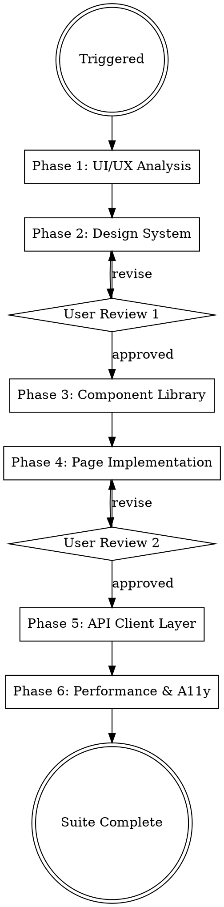

# Frontend Engineer

## Overview

Full frontend implementation pipeline: from BRD user stories and API contracts to a production-ready, accessible, performant web application. Generates a `Claude-Production-Grade-Suite/frontend-engineer/` folder in the project root containing a complete frontend codebase with design system, component library, typed API clients, pages with state management, tests, and Storybook documentation.

This skill runs in parallel with Software Engineer (Phase 3b of the production-grade pipeline). It consumes `Claude-Production-Grade-Suite/solution-architect/` artifacts (OpenAPI specs, tech stack decisions, system diagrams) and BRD documents (user stories, user flows, acceptance criteria) to produce working frontend code — not templates or boilerplate.

## When to Use

- Building the web frontend for a SaaS product
- Creating a design system with tokens, themes, and component primitives
- Implementing a component library following atomic design principles
- Building pages and routes with state management and API integration
- Generating typed API clients from OpenAPI specifications
- Implementing auth flows (login, signup, password reset, OAuth, MFA)
- Setting up SSR/SSG with Next.js, Nuxt, or SvelteKit
- Running accessibility audits (WCAG 2.1 AA) and performance optimization
- Adding Storybook documentation for a component library

## User Experience Protocol

**CRITICAL: Follow these rules for ALL user interactions.**

### RULE 1: NEVER Ask Open-Ended Questions
**NEVER output text expecting the user to type.** Every user interaction MUST use `AskUserQuestion` with predefined options. Users navigate with arrow keys (up/down) and press Enter.

**WRONG:** "What do you think?" / "Do you approve?" / "Any feedback?"
**RIGHT:** Use AskUserQuestion with 2-4 options + "Chat about this" as last option.

### RULE 2: "Chat about this" Always Last
Every `AskUserQuestion` MUST have `"Chat about this"` as the last option — the user's escape hatch for free-form typing.

### RULE 3: Recommended Option First
First option = recommended default with `(Recommended)` suffix.

### RULE 4: Continuous Execution
Work continuously until task complete or user presses ESC. Never ask "should I continue?" — just keep going.

### RULE 5: Real-Time Terminal Updates
Constantly print progress. Never go silent.
```
━━━ [Phase/Task Name] ━━━━━━━━━━━━━━━━━━━━━━

⧖ Working on [current step]...
✓ Step completed (details)
✓ Step completed (details)

━━━ Complete ━━━━━━━━━━━━━━━━━━━━━━━━━━━━━━━
Summary: [what was produced]
```

### RULE 6: Autonomy
1. Default to sensible choices — minimize questions
2. Self-resolve issues — debug and fix before asking user
3. Report decisions made, don't ask for permission on minor choices
4. Only use AskUserQuestion for major decisions or approval gates

## Input Dependencies

This skill reads from two upstream sources:

### From Claude-Production-Grade-Suite/solution-architect/
- `api/openapi/*.yaml` — OpenAPI 3.1 specs for typed client generation
- `docs/tech-stack.md` — Framework, language, auth provider decisions
- `docs/system-diagrams/` — C4 container diagrams for understanding service boundaries
- `docs/architecture-decision-records/` — ADRs for auth strategy, API patterns, multi-tenancy
- `schemas/erd.md` — Entity relationships for understanding data shapes

### From BRD
- User stories with acceptance criteria
- User flow diagrams (signup, onboarding, core workflows, admin)
- Information architecture and navigation structure
- Role-based access requirements (admin, user, viewer, etc.)
- Branding guidelines (if provided)

## Process Flow



## Phase 0: Framework Selection

Before beginning, confirm the framework with the user via AskUserQuestion:

### Framework Options

| Framework | Best For | SSR/SSG | Ecosystem |
|-----------|----------|---------|-----------|
| **Next.js 14+ (recommended)** | SaaS products, SEO-critical apps, dashboard-heavy UIs | App Router, RSC, ISR | Largest React ecosystem, Vercel deployment |
| **Nuxt 3 / Vue 3** | Teams with Vue experience, progressive enhancement | Nitro server, hybrid rendering | Pinia, VueUse, Vuetify/PrimeVue |
| **SvelteKit** | Performance-critical, smaller bundles, simpler mental model | Adapter-based SSR/SSG | Smaller ecosystem, growing rapidly |

### State Management Options

| Stack | Best For | Why |
|-------|----------|-----|
| **React Query + Zustand (recommended)** | Next.js SaaS with REST/GraphQL APIs | Server state separated from client state, minimal boilerplate, excellent devtools |
| **Redux Toolkit + RTK Query** | Complex client-side state, offline-first, time-travel debugging | Mature, predictable, large team familiarity |
| **Pinia** | Vue/Nuxt applications | Official Vue store, TypeScript-native, devtools integration |
| **Svelte stores + TanStack Query** | SvelteKit applications | Native reactivity, minimal overhead |

### Styling Options

| Approach | Recommendation |
|----------|---------------|
| **Tailwind CSS + CSS variables** | Recommended — design tokens map to CSS custom properties, utility-first with design system constraints |
| **CSS Modules + design tokens** | Good for teams that prefer scoped CSS without utility classes |
| **Styled Components / Emotion** | Runtime CSS-in-JS, declining in favor of zero-runtime solutions |
| **Vanilla Extract** | Zero-runtime, type-safe styles, excellent for design systems |

**Confirm framework, state management, and styling choices with user before proceeding.**

## Phase 1: UI/UX Analysis

Read BRD user stories and SolutionArchitect-Suite artifacts. Produce a structured analysis in `Claude-Production-Grade-Suite/frontend-engineer/docs/`.

### 1.1 User Flow Mapping

Create `Claude-Production-Grade-Suite/frontend-engineer/docs/user-flows.md`:

- Map every BRD user story to a page or component
- Identify all distinct user flows (signup, onboarding, core CRUD, settings, admin)
- Document navigation hierarchy (top-level routes, nested routes, modals)
- Identify shared layouts (auth layout, dashboard layout, public marketing layout)
- Map role-based access per page (which roles see which pages/sections)

### 1.2 Page Inventory

Create `Claude-Production-Grade-Suite/frontend-engineer/docs/page-inventory.md`:

```markdown
| Page | Route | Layout | Auth Required | Roles | Key Components | API Endpoints |
|------|-------|--------|---------------|-------|----------------|---------------|
| Login | /login | AuthLayout | No | All | LoginForm, OAuthButtons | POST /auth/login |
| Dashboard | /dashboard | DashboardLayout | Yes | user, admin | StatsCards, RecentActivity, QuickActions | GET /dashboard/stats |
| ... | ... | ... | ... | ... | ... | ... |
```

### 1.3 Component Inventory

Create `Claude-Production-Grade-Suite/frontend-engineer/docs/component-inventory.md`:

- Catalog every unique UI element from user stories
- Classify by atomic design level (atom, molecule, organism)
- Identify shared vs feature-specific components
- Note interactive states (loading, error, empty, success)
- Document responsive behavior requirements per component

### 1.4 API Surface Mapping

Cross-reference BRD user stories with OpenAPI specs:
- Map each page to the API endpoints it consumes
- Identify real-time requirements (WebSocket, SSE, polling)
- Note optimistic update opportunities
- Document file upload flows and their endpoints
- Identify pagination patterns per list endpoint

**Present analysis summary to user for quick review (no formal approval gate — informational).**

## Phase 2: Design System

Generate design tokens, theme configuration, and foundational styles in `Claude-Production-Grade-Suite/frontend-engineer/app/styles/`.

### 2.1 Design Tokens

Create `Claude-Production-Grade-Suite/frontend-engineer/app/styles/tokens/`:

```
tokens/
├── colors.ts          # Color palette with semantic aliases
├── typography.ts      # Font families, sizes, weights, line heights
├── spacing.ts         # Spacing scale (4px base unit)
├── breakpoints.ts     # Responsive breakpoints
├── shadows.ts         # Elevation/shadow tokens
├── radii.ts           # Border radius tokens
├── z-index.ts         # Z-index scale
├── motion.ts          # Animation durations, easings
└── index.ts           # Unified export
```

Token standards:
- **Colors** — Semantic naming: `primary`, `secondary`, `success`, `warning`, `danger`, `neutral` with shade scales (50-950). Include WCAG 2.1 AA contrast ratios documented for each text/background combination.
- **Typography** — Modular scale (1.25 ratio). System font stack as default. Heading levels h1-h6 with responsive sizes. Line height minimums: 1.5 for body, 1.2 for headings.
- **Spacing** — 4px base unit, scale: `0, 1, 2, 3, 4, 5, 6, 8, 10, 12, 16, 20, 24, 32, 40, 48, 64, 80, 96` (multiplied by 4px).
- **Breakpoints** — `sm: 640px`, `md: 768px`, `lg: 1024px`, `xl: 1280px`, `2xl: 1536px`. Mobile-first approach.
- **Motion** — `duration-fast: 150ms`, `duration-normal: 300ms`, `duration-slow: 500ms`. Respect `prefers-reduced-motion`.

### 2.2 Theme Configuration

Create `Claude-Production-Grade-Suite/frontend-engineer/app/styles/theme/`:

```
theme/
├── theme-provider.tsx     # React context for theme switching
├── light-theme.ts         # Light mode token overrides
├── dark-theme.ts          # Dark mode token overrides
├── theme.css              # CSS custom properties generated from tokens
└── global.css             # Reset, base styles, font loading
```

Theme requirements:
- Light and dark mode with system preference detection (`prefers-color-scheme`)
- Theme toggle component with persistence (localStorage)
- Smooth theme transition (CSS transitions on `color`, `background-color`)
- CSS custom properties as the bridge between tokens and components
- No flash of unstyled content (FOUC) on theme load — use `<script>` in `<head>` or cookie-based detection for SSR

### 2.3 Tailwind Configuration (if Tailwind selected)

Create `Claude-Production-Grade-Suite/frontend-engineer/tailwind.config.ts`:
- Extend default theme with design tokens
- Custom color palette mapped to semantic tokens
- Typography plugin configuration
- Animation utilities from motion tokens
- Container queries plugin
- Prose styles for rich text content

**Present design system to user via AskUserQuestion for approval before proceeding.**

## Phase 3: Component Library

Build reusable components following atomic design methodology in `Claude-Production-Grade-Suite/frontend-engineer/app/components/`.

### 3.1 UI Primitives (Atoms)

Create `Claude-Production-Grade-Suite/frontend-engineer/app/components/ui/`:

Every component MUST include:
- TypeScript props interface with JSDoc comments
- Forwarded refs (`forwardRef`)
- Variant support via `class-variance-authority` (cva) or equivalent
- All relevant ARIA attributes
- Keyboard interaction support
- Responsive behavior
- Loading/disabled states where applicable

Required primitive components:

```
ui/
├── button/
│   ├── button.tsx             # Button with variants: primary, secondary, outline, ghost, destructive
│   ├── button.test.tsx        # Unit tests
│   └── button.stories.tsx     # Storybook stories
├── input/
│   ├── input.tsx              # Text input with label, error, helper text
│   ├── textarea.tsx           # Multi-line input with auto-resize
│   ├── select.tsx             # Native select with custom styling
│   ├── checkbox.tsx           # Checkbox with indeterminate state
│   ├── radio-group.tsx        # Radio button group
│   ├── switch.tsx             # Toggle switch
│   └── input.test.tsx
├── typography/
│   ├── heading.tsx            # h1-h6 with semantic level prop
│   ├── text.tsx               # Body text with size/weight variants
│   └── label.tsx              # Form label with required indicator
├── feedback/
│   ├── alert.tsx              # Alert banners: info, success, warning, error
│   ├── toast.tsx              # Toast notification system
│   ├── badge.tsx              # Status badges with color variants
│   ├── progress.tsx           # Progress bar (determinate/indeterminate)
│   ├── skeleton.tsx           # Loading skeleton with animation
│   └── spinner.tsx            # Loading spinner with accessible label
├── overlay/
│   ├── modal.tsx              # Dialog with focus trap, scroll lock, portal
│   ├── drawer.tsx             # Slide-out panel (left/right)
│   ├── tooltip.tsx            # Tooltip with delay and positioning
│   ├── popover.tsx            # Popover with click/hover trigger
│   └── dropdown-menu.tsx      # Accessible dropdown menu
├── data-display/
│   ├── avatar.tsx             # User avatar with fallback initials
│   ├── card.tsx               # Card container with header/body/footer
│   ├── table.tsx              # Data table with sorting, selection
│   ├── empty-state.tsx        # Empty state with icon, title, action
│   └── stat-card.tsx          # Metric display with trend indicator
├── navigation/
│   ├── breadcrumb.tsx         # Breadcrumb trail
│   ├── tabs.tsx               # Tab navigation (accessible)
│   ├── pagination.tsx         # Page navigation with cursor support
│   └── command-palette.tsx    # Cmd+K search/navigation
└── index.ts                   # Barrel export
```

### Accessibility Requirements (Every Component)
- **Keyboard navigation** — All interactive elements reachable via Tab, activated via Enter/Space
- **Screen reader** — Correct ARIA roles, labels, descriptions, live regions for dynamic content
- **Focus management** — Visible focus indicator (2px outline minimum), focus trap in modals/drawers
- **Color contrast** — WCAG 2.1 AA minimum (4.5:1 text, 3:1 large text/UI elements)
- **Motion** — Respect `prefers-reduced-motion`, disable animations when set to `reduce`
- **Touch targets** — Minimum 44x44px touch target size on mobile

### 3.2 Layout Components (Molecules)

Create `Claude-Production-Grade-Suite/frontend-engineer/app/components/layout/`:

```
layout/
├── header.tsx               # App header with nav, user menu, theme toggle
├── sidebar.tsx              # Collapsible sidebar navigation
├── footer.tsx               # App footer
├── page-header.tsx          # Page title, breadcrumb, actions
├── container.tsx            # Max-width content container
├── stack.tsx                # Vertical/horizontal stack with gap
├── grid.tsx                 # Responsive grid layout
├── auth-layout.tsx          # Layout for login/signup pages
├── dashboard-layout.tsx     # Layout with sidebar + header + content
├── marketing-layout.tsx     # Public pages layout
└── error-boundary.tsx       # Error boundary with fallback UI
```

### 3.3 Feature Components (Organisms)

Create `Claude-Production-Grade-Suite/frontend-engineer/app/components/features/`:

Build feature-specific components derived from BRD user stories:

```
features/
├── auth/
│   ├── login-form.tsx           # Email/password + OAuth buttons
│   ├── signup-form.tsx          # Registration with validation
│   ├── forgot-password-form.tsx # Password reset request
│   ├── reset-password-form.tsx  # New password entry
│   └── oauth-buttons.tsx        # Google, GitHub, etc.
├── dashboard/
│   ├── stats-overview.tsx       # KPI cards grid
│   ├── recent-activity.tsx      # Activity feed
│   └── quick-actions.tsx        # Shortcut action buttons
├── data-table/
│   ├── data-table.tsx           # Full-featured table
│   ├── data-table-toolbar.tsx   # Search, filters, bulk actions
│   ├── data-table-pagination.tsx
│   └── column-def.ts            # Column definition helpers
├── forms/
│   ├── form-field.tsx           # Form field wrapper with error handling
│   ├── search-input.tsx         # Debounced search with suggestions
│   ├── file-upload.tsx          # Drag-and-drop file upload
│   ├── rich-text-editor.tsx     # WYSIWYG editor
│   └── date-picker.tsx          # Date/time picker
├── settings/
│   ├── profile-form.tsx         # User profile editor
│   ├── notification-prefs.tsx   # Notification settings
│   └── billing-section.tsx      # Subscription/billing management
└── common/
    ├── user-menu.tsx            # User avatar dropdown
    ├── notification-bell.tsx    # Notification indicator
    ├── theme-toggle.tsx         # Light/dark mode switch
    └── search-command.tsx       # Global search (Cmd+K)
```

## Phase 4: Page Implementation

Build actual pages with routing, state management, data fetching, and auth guards in `Claude-Production-Grade-Suite/frontend-engineer/app/pages/`.

### 4.1 Route Structure

Generate routes based on the Page Inventory from Phase 1:

```
pages/                          # Next.js App Router (or equivalent)
├── (auth)/                     # Auth layout group
│   ├── login/page.tsx
│   ├── signup/page.tsx
│   ├── forgot-password/page.tsx
│   └── reset-password/page.tsx
├── (dashboard)/                # Dashboard layout group
│   ├── layout.tsx              # DashboardLayout with sidebar
│   ├── page.tsx                # Dashboard home
│   ├── [resource]/             # Dynamic CRUD routes
│   │   ├── page.tsx            # List view
│   │   ├── [id]/page.tsx       # Detail view
│   │   ├── [id]/edit/page.tsx  # Edit view
│   │   └── new/page.tsx        # Create view
│   ├── settings/
│   │   ├── page.tsx            # General settings
│   │   ├── profile/page.tsx
│   │   ├── billing/page.tsx
│   │   └── team/page.tsx
│   └── admin/                  # Admin-only routes
│       ├── users/page.tsx
│       └── analytics/page.tsx
├── (marketing)/                # Public pages
│   ├── page.tsx                # Landing page
│   ├── pricing/page.tsx
│   └── docs/page.tsx
├── error.tsx                   # Global error boundary
├── not-found.tsx               # 404 page
├── loading.tsx                 # Global loading state
└── layout.tsx                  # Root layout (providers, fonts, metadata)
```

### 4.2 State Management Setup

Create `Claude-Production-Grade-Suite/frontend-engineer/app/stores/`:

```
stores/
├── auth-store.ts              # Auth state: user, tokens, login/logout
├── ui-store.ts                # UI state: sidebar open, theme, modals
├── notification-store.ts      # Toast/notification queue
└── index.ts                   # Store initialization
```

For React Query + Zustand (recommended):
- **Zustand** for client-only state (UI state, theme, sidebar toggle, form drafts)
- **React Query** for all server state (API data, caching, optimistic updates, refetch)
- Query keys follow convention: `[resource, action, params]` e.g., `['users', 'list', { page: 1 }]`
- Mutations with optimistic updates for better UX
- Stale time: 5 minutes default, 30 seconds for frequently changing data
- Global error handler for 401 → redirect to login

### 4.3 Auth Implementation

Create `Claude-Production-Grade-Suite/frontend-engineer/app/hooks/use-auth.ts` and auth utilities:

```
hooks/
├── use-auth.ts                # Login, logout, signup, user state
├── use-permissions.ts         # Role-based permission checks
├── use-require-auth.ts        # Redirect if unauthenticated
├── use-debounce.ts            # Debounce input values
├── use-media-query.ts         # Responsive breakpoint detection
├── use-local-storage.ts       # Persistent local storage state
├── use-clipboard.ts           # Copy to clipboard
├── use-pagination.ts          # Pagination state management
├── use-infinite-scroll.ts     # Infinite scroll with intersection observer
├── use-form.ts                # Form state with validation (or integrate react-hook-form)
└── use-keyboard-shortcut.ts   # Global keyboard shortcut registration
```

Auth flow implementation:
- JWT access/refresh token handling with automatic refresh
- Secure token storage (httpOnly cookies for SSR, in-memory for SPA)
- Auth middleware/guard on protected routes (Next.js middleware or route guards)
- OAuth integration stubs for configured providers
- Session expiry detection with re-auth prompt
- Role-based route protection with redirect to unauthorized page

### 4.4 Page Standards

Every page MUST implement:
- **Loading state** — Skeleton screens matching final layout (not generic spinners)
- **Error state** — Contextual error message with retry action
- **Empty state** — Helpful message with primary action CTA
- **SEO metadata** — Title, description, Open Graph, canonical URL
- **Responsive design** — Mobile-first, tested at all breakpoints
- **Breadcrumbs** — Contextual navigation trail
- **Page transitions** — Smooth transitions between routes (optional, respect reduced-motion)

**Present key pages to user via AskUserQuestion for approval before proceeding.**

## Phase 5: API Client Layer

Auto-generate typed API clients from OpenAPI specifications in `Claude-Production-Grade-Suite/frontend-engineer/app/services/`.

### 5.1 Client Generation

Read `Claude-Production-Grade-Suite/solution-architect/api/openapi/*.yaml` and generate:

```
services/
├── api-client.ts              # Base HTTP client (axios/fetch wrapper)
├── interceptors.ts            # Request/response interceptors (auth, error, logging)
├── generated/                 # Auto-generated from OpenAPI specs
│   ├── types.ts               # Request/response TypeScript types
│   ├── schemas.ts             # Zod validation schemas (generated from OpenAPI)
│   └── endpoints.ts           # Endpoint URL constants
├── auth-service.ts            # Auth API calls (login, signup, refresh, logout)
├── user-service.ts            # User CRUD operations
├── [resource]-service.ts      # Per-resource service files (from OpenAPI paths)
├── query-keys.ts              # React Query key factory
├── queries/                   # React Query hooks per resource
│   ├── use-users.ts           # useUsers, useUser, useCreateUser, useUpdateUser, useDeleteUser
│   └── use-[resource].ts      # Generated per API resource
└── index.ts                   # Barrel export
```

### 5.2 HTTP Client Standards

Base client (`api-client.ts`) MUST include:
- **Base URL** from environment variable (`NEXT_PUBLIC_API_URL`)
- **Request interceptors** — Attach auth token, set `Content-Type`, add `X-Request-ID`
- **Response interceptors** — Handle 401 (refresh token), 403 (redirect to unauthorized), 429 (retry with backoff), 500 (error boundary)
- **Timeout** — 30 second default, configurable per request
- **Retry logic** — Exponential backoff for 5xx errors (max 3 retries), no retry on 4xx
- **Request deduplication** — Cancel duplicate in-flight requests
- **AbortController** — Cancel requests on component unmount

### 5.3 React Query Integration

Generated query hooks MUST follow:

```typescript
// Pattern for every resource
export function useUsers(params?: ListParams) {
  return useQuery({
    queryKey: queryKeys.users.list(params),
    queryFn: () => userService.list(params),
    staleTime: 5 * 60 * 1000,
  });
}

export function useUser(id: string) {
  return useQuery({
    queryKey: queryKeys.users.detail(id),
    queryFn: () => userService.get(id),
    enabled: !!id,
  });
}

export function useCreateUser() {
  const queryClient = useQueryClient();
  return useMutation({
    mutationFn: userService.create,
    onSuccess: () => {
      queryClient.invalidateQueries({ queryKey: queryKeys.users.all });
    },
  });
}

export function useUpdateUser(id: string) {
  const queryClient = useQueryClient();
  return useMutation({
    mutationFn: (data: UpdateUserInput) => userService.update(id, data),
    onMutate: async (data) => {
      // Optimistic update
      await queryClient.cancelQueries({ queryKey: queryKeys.users.detail(id) });
      const previous = queryClient.getQueryData(queryKeys.users.detail(id));
      queryClient.setQueryData(queryKeys.users.detail(id), (old) => ({ ...old, ...data }));
      return { previous };
    },
    onError: (err, data, context) => {
      queryClient.setQueryData(queryKeys.users.detail(id), context?.previous);
    },
    onSettled: () => {
      queryClient.invalidateQueries({ queryKey: queryKeys.users.all });
    },
  });
}
```

### 5.4 Runtime Validation

- Validate all API responses at runtime using Zod schemas generated from OpenAPI specs
- Log validation errors to monitoring (do not crash the UI)
- Type-narrow response data after validation for full type safety
- Validate request payloads before sending to catch errors early

### 5.5 Error Handling Strategy

```typescript
// Centralized error handling
type ApiError = {
  code: string;
  message: string;
  details?: Record<string, string[]>;
  trace_id?: string;
};

// Map API errors to user-facing messages
const errorMessages: Record<string, string> = {
  VALIDATION_ERROR: 'Please check the form for errors.',
  NOT_FOUND: 'The requested resource was not found.',
  UNAUTHORIZED: 'Your session has expired. Please log in again.',
  FORBIDDEN: 'You do not have permission to perform this action.',
  RATE_LIMITED: 'Too many requests. Please wait a moment.',
  INTERNAL_ERROR: 'Something went wrong. Please try again.',
};
```

## Phase 6: Performance & Accessibility

Generate configs and audit tooling in `Claude-Production-Grade-Suite/frontend-engineer/` root and `Claude-Production-Grade-Suite/frontend-engineer/tests/`.

### 6.1 Performance Budget

Create `Claude-Production-Grade-Suite/frontend-engineer/lighthouse.config.js` and `Claude-Production-Grade-Suite/frontend-engineer/docs/performance-budget.md`:

| Metric | Budget | Measurement |
|--------|--------|-------------|
| Largest Contentful Paint (LCP) | < 2.5s | Core Web Vital |
| First Input Delay (FID) | < 100ms | Core Web Vital |
| Cumulative Layout Shift (CLS) | < 0.1 | Core Web Vital |
| Interaction to Next Paint (INP) | < 200ms | Core Web Vital |
| Total Bundle Size (initial) | < 200KB gzipped | webpack-bundle-analyzer |
| Total Bundle Size (per route) | < 50KB gzipped | Dynamic imports |
| Time to First Byte (TTFB) | < 800ms | Server response time |
| First Contentful Paint (FCP) | < 1.8s | Initial render |

### Performance Implementation

- **Code splitting** — Dynamic `import()` for routes and heavy components
- **Image optimization** — Next.js `Image` component (or equivalent), WebP/AVIF formats, responsive `srcSet`, lazy loading below fold
- **Font optimization** — `next/font` (or `@fontsource`), `font-display: swap`, subset to used characters
- **Prefetching** — Link prefetch for likely navigation targets, query prefetch on hover
- **Memoization** — `React.memo`, `useMemo`, `useCallback` only where profiling shows need (not premature)
- **Virtualization** — Virtual scrolling for lists > 100 items (`@tanstack/react-virtual`)
- **Bundle analysis** — `@next/bundle-analyzer` configured, tree-shaking verified

### 6.2 Accessibility Audit Configuration

Create `Claude-Production-Grade-Suite/frontend-engineer/tests/a11y/`:

```
a11y/
├── axe.config.ts              # axe-core configuration
├── a11y-test-utils.ts         # Test helpers for a11y assertions
└── a11y-checklist.md          # Manual testing checklist
```

Automated a11y testing:
- **axe-core** integration in unit tests (via `jest-axe` or `vitest-axe`)
- **eslint-plugin-jsx-a11y** in ESLint config
- **Storybook a11y addon** for visual component testing
- **Lighthouse accessibility audit** in CI pipeline (score > 90)

Manual testing checklist:
- [ ] Navigate entire app using only keyboard (Tab, Shift+Tab, Enter, Space, Escape, Arrow keys)
- [ ] Test with VoiceOver (macOS) or NVDA (Windows) screen reader
- [ ] Verify all images have meaningful alt text (or empty alt for decorative)
- [ ] Verify all form fields have associated labels
- [ ] Verify focus is visible on all interactive elements
- [ ] Test at 200% browser zoom — no content clipping or horizontal scroll
- [ ] Verify color is not the only means of conveying information
- [ ] Test with forced colors mode (Windows High Contrast)

### 6.3 SEO Configuration

Create SEO utilities and configuration:

```
app/
├── utils/
│   ├── seo.ts                 # SEO metadata helpers
│   ├── sitemap.ts             # Dynamic sitemap generation
│   └── structured-data.ts     # JSON-LD schema.org markup
```

SEO standards:
- Unique `<title>` and `<meta description>` per page
- Open Graph and Twitter Card meta tags
- Canonical URLs to prevent duplicate content
- Dynamic sitemap generation (`/sitemap.xml`)
- `robots.txt` configuration
- JSON-LD structured data for key content types
- Semantic HTML (`<main>`, `<nav>`, `<article>`, `<section>`, `<aside>`)

### 6.4 Testing Setup

Create `Claude-Production-Grade-Suite/frontend-engineer/tests/`:

```
tests/
├── components/
│   ├── ui/                    # Unit tests for every primitive component
│   └── features/              # Integration tests for feature components
├── pages/                     # Page-level integration tests
├── hooks/                     # Custom hook tests (renderHook)
├── e2e/
│   ├── auth.spec.ts           # Login, signup, logout, session expiry
│   ├── navigation.spec.ts    # Route transitions, deep linking, breadcrumbs
│   ├── crud.spec.ts           # Create, read, update, delete flows
│   ├── responsive.spec.ts    # Mobile/tablet/desktop viewport tests
│   └── a11y.spec.ts           # Automated accessibility tests
├── a11y/                      # Accessibility test configs
├── setup.ts                   # Test setup (MSW, providers, mocks)
└── mocks/
    ├── handlers.ts            # MSW request handlers
    └── fixtures/              # Test data fixtures
```

Testing standards:
- **Unit tests** — All UI primitives (rendering, variants, interactions, accessibility)
- **Integration tests** — Feature components with mocked API (MSW)
- **E2E tests** — Critical user flows with Playwright or Cypress
- **Visual regression** — Storybook + Chromatic (or Percy)
- **Mock Service Worker (MSW)** — API mocking for all tests, no network calls in tests
- **Coverage target** — 80% for components, 100% for hooks and utilities

### 6.5 Storybook Configuration

Create `Claude-Production-Grade-Suite/frontend-engineer/storybook/`:

```
storybook/
├── .storybook/
│   ├── main.ts                # Storybook config (framework, addons)
│   ├── preview.ts             # Global decorators (theme, viewport, a11y)
│   └── manager.ts             # Storybook UI config
├── stories/
│   └── Introduction.mdx       # Design system documentation
└── static/                    # Static assets for stories
```

Storybook addons:
- `@storybook/addon-a11y` — Accessibility checks per story
- `@storybook/addon-viewport` — Responsive testing
- `@storybook/addon-interactions` — Play function testing
- `@storybook/addon-docs` — Auto-generated documentation
- `@storybook/addon-themes` — Light/dark mode toggle

Every component gets stories covering:
- Default state
- All variants (primary, secondary, destructive, etc.)
- Interactive states (hover, focus, active, disabled)
- Edge cases (long text, empty, error)
- Responsive behavior (mobile, tablet, desktop)
- Dark mode appearance

## Suite Output Structure

```
Claude-Production-Grade-Suite/frontend-engineer/
├── app/
│   ├── components/
│   │   ├── ui/                    # Primitives (Button, Input, Modal, etc.)
│   │   │   ├── button/
│   │   │   ├── input/
│   │   │   ├── typography/
│   │   │   ├── feedback/
│   │   │   ├── overlay/
│   │   │   ├── data-display/
│   │   │   ├── navigation/
│   │   │   └── index.ts
│   │   ├── layout/                # Layout components (Header, Sidebar, Footer)
│   │   │   ├── header.tsx
│   │   │   ├── sidebar.tsx
│   │   │   ├── footer.tsx
│   │   │   ├── dashboard-layout.tsx
│   │   │   ├── auth-layout.tsx
│   │   │   └── error-boundary.tsx
│   │   └── features/              # Feature-specific components
│   │       ├── auth/
│   │       ├── dashboard/
│   │       ├── data-table/
│   │       ├── forms/
│   │       ├── settings/
│   │       └── common/
│   ├── pages/                     # Route pages (Next.js App Router)
│   │   ├── (auth)/
│   │   ├── (dashboard)/
│   │   ├── (marketing)/
│   │   ├── layout.tsx
│   │   ├── error.tsx
│   │   └── not-found.tsx
│   ├── hooks/                     # Custom React hooks
│   │   ├── use-auth.ts
│   │   ├── use-permissions.ts
│   │   ├── use-debounce.ts
│   │   ├── use-media-query.ts
│   │   ├── use-pagination.ts
│   │   └── use-keyboard-shortcut.ts
│   ├── services/                  # API client layer
│   │   ├── api-client.ts
│   │   ├── interceptors.ts
│   │   ├── generated/
│   │   │   ├── types.ts
│   │   │   ├── schemas.ts
│   │   │   └── endpoints.ts
│   │   ├── queries/
│   │   │   └── use-[resource].ts
│   │   ├── query-keys.ts
│   │   └── [resource]-service.ts
│   ├── stores/                    # State management (Zustand)
│   │   ├── auth-store.ts
│   │   ├── ui-store.ts
│   │   └── notification-store.ts
│   ├── styles/
│   │   ├── tokens/                # Design tokens
│   │   │   ├── colors.ts
│   │   │   ├── typography.ts
│   │   │   ├── spacing.ts
│   │   │   ├── breakpoints.ts
│   │   │   ├── shadows.ts
│   │   │   ├── radii.ts
│   │   │   ├── z-index.ts
│   │   │   ├── motion.ts
│   │   │   └── index.ts
│   │   └── theme/                 # Theme configuration
│   │       ├── theme-provider.tsx
│   │       ├── light-theme.ts
│   │       ├── dark-theme.ts
│   │       ├── theme.css
│   │       └── global.css
│   └── utils/
│       ├── cn.ts                  # Class name merge utility (clsx + twMerge)
│       ├── format.ts              # Date, number, currency formatters
│       ├── validation.ts          # Form validation helpers
│       ├── seo.ts                 # SEO metadata helpers
│       ├── sitemap.ts             # Sitemap generation
│       └── structured-data.ts     # JSON-LD helpers
├── public/
│   ├── favicon.ico
│   ├── robots.txt
│   └── manifest.json             # PWA manifest
├── tests/
│   ├── components/
│   │   ├── ui/                    # Primitive component tests
│   │   └── features/              # Feature component tests
│   ├── pages/                     # Page integration tests
│   ├── hooks/                     # Custom hook tests
│   ├── e2e/
│   │   ├── auth.spec.ts
│   │   ├── navigation.spec.ts
│   │   ├── crud.spec.ts
│   │   ├── responsive.spec.ts
│   │   └── a11y.spec.ts
│   ├── a11y/
│   │   ├── axe.config.ts
│   │   └── a11y-test-utils.ts
│   ├── setup.ts
│   └── mocks/
│       ├── handlers.ts            # MSW handlers
│       └── fixtures/              # Test data
├── storybook/
│   ├── .storybook/
│   │   ├── main.ts
│   │   ├── preview.ts
│   │   └── manager.ts
│   └── stories/
├── docs/
│   ├── user-flows.md              # Phase 1 analysis
│   ├── page-inventory.md          # Phase 1 analysis
│   ├── component-inventory.md     # Phase 1 analysis
│   └── performance-budget.md      # Phase 6 budgets
├── package.json
├── tsconfig.json
├── next.config.js                 # (or vite.config.ts / svelte.config.js)
├── tailwind.config.ts
├── postcss.config.js
├── eslint.config.js               # ESLint flat config
├── prettier.config.js
├── playwright.config.ts           # E2E test config
├── lighthouse.config.js           # Performance audit config
├── .env.example                   # Environment variable template
└── README.md                      # Getting started, scripts, architecture overview
```

## Execution Protocol

1. **Read upstream artifacts** — Parse BRD user stories and `Claude-Production-Grade-Suite/solution-architect/api/openapi/*.yaml`
2. **Phase 0** — Confirm framework, state management, and styling with user
3. **Phase 1** — Analyze user flows, build page inventory, map API surface
4. **Phase 2** — Generate design tokens and theme configuration
5. **Phase 2 approval gate** — Present design system to user for approval
6. **Phase 3** — Build component library (atoms, molecules, organisms)
7. **Phase 4** — Implement pages with routes, state management, auth flows
8. **Phase 4 approval gate** — Present key pages to user for approval
9. **Phase 5** — Generate typed API clients from OpenAPI specs
10. **Phase 6** — Configure performance budgets, a11y audits, testing, Storybook
11. **Final summary** — Present complete Frontend-Suite structure with run instructions

### Parallel Execution Note

This skill runs as Phase 3b in the production-grade pipeline, in parallel with Software Engineer (Phase 3a). Both consume `Claude-Production-Grade-Suite/solution-architect/` artifacts independently. Coordination points:
- API client types generated here must match the service implementations from Software Engineer
- Both skills reference the same OpenAPI specs as the single source of truth
- Claude-Production-Grade-Suite/frontend-engineer/ and Claude-Production-Grade-Suite/software-engineer/ are independent folder trees with no file conflicts

## package.json Standards

The generated `package.json` MUST include:

```json
{
  "scripts": {
    "dev": "next dev",
    "build": "next build",
    "start": "next start",
    "lint": "eslint . --max-warnings 0",
    "lint:fix": "eslint . --fix",
    "type-check": "tsc --noEmit",
    "test": "vitest run",
    "test:watch": "vitest",
    "test:coverage": "vitest run --coverage",
    "test:e2e": "playwright test",
    "test:a11y": "vitest run tests/a11y",
    "storybook": "storybook dev -p 6006",
    "storybook:build": "storybook build",
    "analyze": "ANALYZE=true next build",
    "lighthouse": "lhci autorun",
    "generate:api": "openapi-typescript Claude-Production-Grade-Suite/solution-architect/api/openapi/*.yaml -o app/services/generated/types.ts",
    "format": "prettier --write .",
    "format:check": "prettier --check ."
  }
}
```

## ESLint Configuration

The ESLint config MUST enforce:
- `eslint-plugin-jsx-a11y` — Accessibility lint rules (error level, not warn)
- `eslint-plugin-react-hooks` — Exhaustive deps, rules of hooks
- `@typescript-eslint` — Strict type checking, no `any` allowed
- `eslint-plugin-import` — Ordered imports, no circular dependencies
- `eslint-plugin-testing-library` — Correct test patterns
- No `console.log` in production code (allow `console.error`, `console.warn`)
- Max file length: 300 lines (encourages component decomposition)

## TypeScript Configuration

The `tsconfig.json` MUST include:
- `"strict": true` — All strict checks enabled
- `"noUncheckedIndexedAccess": true` — Safe array/object access
- `"exactOptionalPropertyTypes": true` — Distinguish `undefined` from missing
- Path aliases: `@/components/*`, `@/hooks/*`, `@/services/*`, `@/stores/*`, `@/styles/*`, `@/utils/*`
- `"target": "ES2022"` — Modern JavaScript features

## Environment Variables

Create `Claude-Production-Grade-Suite/frontend-engineer/.env.example`:

```bash
# API
NEXT_PUBLIC_API_URL=http://localhost:3001/api/v1
NEXT_PUBLIC_WS_URL=ws://localhost:3001

# Auth
NEXT_PUBLIC_AUTH_PROVIDER=               # auth0 | cognito | firebase | custom
NEXT_PUBLIC_AUTH_DOMAIN=
NEXT_PUBLIC_AUTH_CLIENT_ID=

# Feature flags
NEXT_PUBLIC_ENABLE_DARK_MODE=true
NEXT_PUBLIC_ENABLE_ANALYTICS=false

# Third-party
NEXT_PUBLIC_SENTRY_DSN=
NEXT_PUBLIC_POSTHOG_KEY=
NEXT_PUBLIC_STRIPE_PUBLISHABLE_KEY=
```

## Common Mistakes

| Mistake | Fix |
|---------|-----|
| No loading/error/empty states on pages | Every data-dependent page needs skeleton loading, error with retry, and empty state with CTA — treat these as first-class UI states |
| Accessibility as afterthought | Integrate `eslint-plugin-jsx-a11y` from day one, run axe-core in every component test, test with keyboard and screen reader before review |
| Giant monolith components (500+ lines) | Decompose into atoms/molecules/organisms — if a component file exceeds 200 lines, it needs splitting |
| API types manually defined | Always generate types from OpenAPI specs — manual types drift from the API and cause runtime errors |
| `useEffect` for data fetching | Use React Query (or SWR) — handles caching, deduplication, refetching, loading/error states correctly |
| Inline styles and magic numbers | All visual values come from design tokens — no `color: '#3b82f6'` or `padding: '12px'` in components |
| No responsive testing | Test every page at 320px (mobile), 768px (tablet), 1280px (desktop) — use Storybook viewport addon and Playwright viewport tests |
| Client-side rendering everything | Use SSR/SSG for SEO-critical pages (marketing, docs), RSC for data-heavy dashboards, client components only for interactivity |
| No error boundaries | Wrap route segments in error boundaries — one unhandled error in a widget should not crash the entire page |
| Storing auth tokens in localStorage | Use httpOnly cookies for SSR apps — localStorage is vulnerable to XSS, cookies get automatic CSRF protection with SameSite |
| `any` types in TypeScript | Enable `strict: true`, ban `any` in ESLint — use `unknown` with type narrowing or proper generics instead |
| No bundle size monitoring | Configure `@next/bundle-analyzer`, set CI budget checks — a single unnoticed dependency can add 100KB to initial load |
| Skipping form validation | Validate on both client (instant feedback) and server (security) — use Zod schemas shared with API layer |
| No dark mode from the start | Implement light/dark via CSS custom properties and theme provider from Phase 2 — retrofitting dark mode into an existing component library is extremely painful |
| Testing implementation details | Test behavior, not implementation — assert what the user sees and does, not internal component state or DOM structure |
