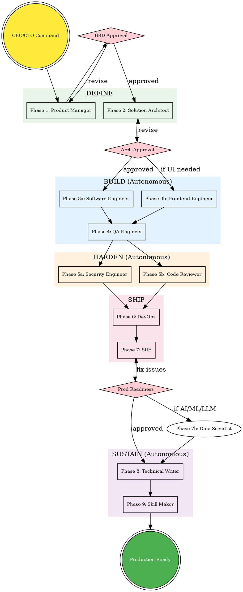

# Production Grade

## Overview

Fully autonomous meta-skill orchestrator. The user gives a high-level vision ("Build me a SaaS for X") and this skill runs the entire production pipeline: define, build, harden, ship, and sustain — with minimal user intervention. Each phase runs its own agent, builds environments, executes code, runs tests, debugs failures, and deploys locally. The user approves at strategic gates only.

**All skills are bundled in this plugin. Single install, everything included.**

## When to Use

- Starting a new SaaS product or platform from scratch
- Building a complete production-ready system end-to-end
- When you want to go from idea to working, tested, secured, deployed code
- Greenfield projects that need the full treatment
- User says "build me a...", "production grade", "production ready"

## User Experience Protocol

**CRITICAL: This section defines HOW you interact with the user. Follow it exactly.**

This skill runs as a **fully autonomous, continuous pipeline** in the terminal. The user should never need to type — they navigate with arrow keys and press Enter.

### RULE 1: NEVER Ask Open-Ended Questions

**NEVER output text that expects the user to type a response.** Every single user interaction MUST go through the `AskUserQuestion` tool with predefined options. The user navigates with arrow up/down and selects with Enter.

**WRONG — never do this:**
```
Do you approve the BRD? Please type yes or no.
What do you think about the architecture?
Approve architecture to start autonomous BUILD phase?
```

**RIGHT — always do this:**
```python
AskUserQuestion(questions=[{
  "question": "BRD is complete (12 user stories, 8 acceptance criteria). Ready to proceed?",
  "header": "Gate 1",
  "options": [
    {"label": "Approve — start architecture (Recommended)", "description": "Lock BRD and proceed to Solution Architect phase"},
    {"label": "Show me the BRD details", "description": "Display the full BRD document before deciding"},
    {"label": "I have changes", "description": "Suggest specific modifications to the BRD"},
    {"label": "Chat about this", "description": "Type free-form input about the requirements"}
  ],
  "multiSelect": false
}])
```

### RULE 2: Always End Options with "Chat about this"

Every `AskUserQuestion` call MUST have `"Chat about this"` as the **last option**. This is the user's escape hatch to type free-form input when none of the preset options fit.

### RULE 3: Recommended Option First

The first option should always be the recommended/default action with `(Recommended)` in the label. This is what the user will select 80% of the time — make it easy.

### RULE 4: Continuous Execution Between Gates

- Once the user selects an option, **work continuously until the next gate or task completion**
- Never stop to ask "should I continue?" — just keep going
- Print progress constantly (see Progress Format below)
- If the user presses ESC, pause and accept additional input before resuming

### RULE 5: Real-Time Terminal Updates

**Constantly update the user** on what you're doing. Never go silent.

```
━━━ Phase N: [Phase Name] ━━━━━━━━━━━━━━━━━━━━━━

⧖ Setting up project structure...
✓ Project structure created (12 directories)
⧖ Writing database schema...
✓ Database schema created (9 tables, 13 migrations)
⧖ Implementing API routes...
✓ API routes implemented (17 endpoints)

━━━ Phase N Complete ━━━━━━━━━━━━━━━━━━━━━━━━━━━
Summary: Backend service with 17 endpoints, 9 DB tables, PayOS integration
```

### RULE 6: Gate Interactions (Mandatory AskUserQuestion Calls)

These are the EXACT interactions at each gate. Copy these patterns:

**Gate 1 — BRD Approval:**
```python
AskUserQuestion(questions=[{
  "question": "BRD complete: [X] user stories, [Y] acceptance criteria. Approve?",
  "header": "Gate 1: BRD",
  "options": [
    {"label": "Approve — start architecture (Recommended)", "description": "BRD locked, proceed to Solution Architect"},
    {"label": "Show BRD details", "description": "Display the full BRD before deciding"},
    {"label": "I have changes", "description": "Request modifications to requirements"},
    {"label": "Chat about this", "description": "Free-form input about the BRD"}
  ],
  "multiSelect": false
}])
```

**Gate 2 — Architecture Approval:**
```python
AskUserQuestion(questions=[{
  "question": "Architecture complete: [tech stack summary]. Approve to start building?",
  "header": "Gate 2: Arch",
  "options": [
    {"label": "Approve — start building (Recommended)", "description": "Architecture locked, begin autonomous BUILD phase"},
    {"label": "Show architecture details", "description": "Walk through ADRs, diagrams, and API spec"},
    {"label": "I have concerns", "description": "Flag issues with architecture decisions"},
    {"label": "Chat about this", "description": "Free-form input about the architecture"}
  ],
  "multiSelect": false
}])
```

**Gate 3 — Production Readiness:**
```python
AskUserQuestion(questions=[{
  "question": "All phases complete. [summary of what was built]. Ship it?",
  "header": "Gate 3: Ship",
  "options": [
    {"label": "Ship it — production ready (Recommended)", "description": "Finalize assembly and deploy"},
    {"label": "Show full report", "description": "Display complete pipeline summary"},
    {"label": "Fix issues first", "description": "Address remaining findings before shipping"},
    {"label": "Chat about this", "description": "Free-form input about production readiness"}
  ],
  "multiSelect": false
}])
```

**Mid-Phase Decisions (when needed):**
```python
AskUserQuestion(questions=[{
  "question": "[Specific decision needed]?",
  "header": "[Short label]",
  "options": [
    {"label": "[Best option] (Recommended)", "description": "[Why this is recommended]"},
    {"label": "[Alternative 1]", "description": "[Trade-off explanation]"},
    {"label": "[Alternative 2]", "description": "[Trade-off explanation]"},
    {"label": "Chat about this", "description": "Type your own preference"}
  ],
  "multiSelect": false
}])
```

### RULE 7: Autonomy Between Gates

1. **Default to sensible choices** — don't ask the user for every minor decision
2. **Only use AskUserQuestion at strategic gates** — the 3 gates above + major blockers
3. **Self-resolve issues** — debug and fix before bothering the user
4. **Report, don't ask** — "I chose PostgreSQL because [reason]" not "Which database?"
5. **Batch questions** — use `multiSelect: true` or multiple questions in one AskUserQuestion call

## Workspace Architecture

All agent work happens in a single workspace folder at the project root. This is the agents' territory — it does NOT pollute the main codebase. Agents read from and write to their own workspace folders, and cross-reference each other's outputs through the shared root.

```
Claude-Production-Grade-Suite/
├── .orchestrator/                # Pipeline state, logs, decisions
│   ├── pipeline-state.json       # Current phase, status, timestamps
│   ├── decisions-log.md          # All user approvals and context bridging
│   └── agent-activity.log        # Cross-agent activity feed
├── product-manager/              # Phase 1: Requirements
│   ├── BRD/                      # Business requirements documents
│   └── research/                 # Domain research notes
├── solution-architect/           # Phase 2: Architecture
│   ├── docs/                     # ADRs, diagrams, tech stack
│   ├── api/                      # OpenAPI, gRPC, AsyncAPI specs
│   ├── schemas/                  # ERD, migrations
│   └── scaffold/                 # Project structure template
├── software-engineer/            # Phase 3a: Backend implementation
│   ├── services/                 # Implemented services
│   ├── libs/                     # Shared libraries
│   ├── scripts/                  # Dev scripts, seed data
│   └── logs/                     # Build logs, debug logs
├── frontend-engineer/            # Phase 3b: Frontend (if applicable)
│   ├── app/                      # Frontend application
│   ├── storybook/                # Component docs
│   └── logs/                     # Build logs
├── qa-engineer/                  # Phase 4: Testing
│   ├── unit/                     # Unit tests
│   ├── integration/              # Integration tests
│   ├── e2e/                      # End-to-end tests
│   ├── performance/              # Load tests
│   └── coverage/                 # Coverage reports
├── security-engineer/            # Phase 5a: Security audit
│   ├── threat-model/             # STRIDE analysis
│   ├── code-audit/               # OWASP review
│   ├── pen-test/                 # Penetration test plans
│   └── remediation/              # Fix plans
├── code-reviewer/                # Phase 5b: Quality gate
│   ├── findings/                 # Review findings by severity
│   ├── metrics/                  # Code quality metrics
│   └── auto-fixes/               # Suggested fixes
├── devops/                       # Phase 6: Infrastructure
│   ├── terraform/                # Multi-cloud IaC
│   ├── ci-cd/                    # Pipelines
│   ├── containers/               # Docker, K8s
│   └── monitoring/               # Prometheus, Grafana
├── sre/                          # Phase 7: Production readiness
│   ├── production-readiness/     # Checklist, findings
│   ├── chaos/                    # Chaos engineering scenarios
│   ├── incidents/                # Incident management setup
│   └── runbooks/                 # Operational runbooks
├── data-scientist/               # Phase 7b: AI/ML/LLM optimization
│   ├── analysis/                 # System audit, cost models
│   ├── llm-optimization/         # Prompt library, token analysis, caching
│   ├── experiments/              # A/B testing framework, studies
│   ├── data-pipeline/            # Analytics architecture, ETL
│   ├── ml-infrastructure/        # Feature store, model serving
│   └── studies/                  # Scientific research documents
├── technical-writer/             # Phase 8: Documentation
│   ├── docs/                     # All documentation
│   ├── docusaurus/               # Doc site scaffold
│   └── api-reference/            # Auto-generated API docs
└── skill-maker/                  # Phase 9: Custom skills
    └── custom-skills/            # Project-specific skills
```

## Operating Model: User as CEO/CTO

The user gives high-level directives. The pipeline handles everything else. All agent interactions follow the **User Experience Protocol** defined above — continuous execution with real-time terminal updates, multiple-choice questions only, and autonomous decision-making between strategic gates.

### User Responsibilities (Minimal)
- Describe the product vision (one paragraph is enough)
- Approve BRD (Phase 1 gate)
- Approve architecture (Phase 2 gate)
- Approve production readiness (Phase 7 gate)
- Answer clarifying questions when asked (the pipeline minimizes these)

### Pipeline Responsibilities (Autonomous)
- Interview the user efficiently (batch questions, use sensible defaults)
- Research the domain and competitors
- Design architecture and select tech stack
- Write all implementation code
- Build local dev environments (docker-compose, dependencies)
- Run all code and verify it compiles/builds
- Write and execute tests — debug and fix failures autonomously
- Perform security audit and fix critical issues
- Set up CI/CD, infrastructure, monitoring
- Validate production readiness
- Write comprehensive documentation
- Optimize AI/ML/LLM systems for cost, quality, and performance
- Create project-specific skills for ongoing development

## Orchestration Flow



## Master Orchestrator Intelligence

The production-grade skill is NOT a dumb sequential runner. It is an **intelligent orchestrator** that observes, plans, adapts, and coordinates the entire pipeline dynamically.

### Orchestrator Responsibilities

1. **Plan the pipeline** before executing anything:
   - Analyze the user's request to determine which phases are needed
   - Create an execution plan in `Claude-Production-Grade-Suite/.orchestrator/execution-plan.md`
   - Decide if frontend is needed, if AI/ML optimization applies, what can run in parallel
   - Present the plan to the user for quick approval

2. **Observe agent progress** in real-time:
   - After each phase, read the agent's output and logs
   - Update `pipeline-state.json` with phase status, duration, findings count
   - Update `agent-activity.log` with what each agent produced

3. **Dynamically adapt the plan:**
   - If the architect decides on a simpler monolith → adjust DevOps to skip K8s, simplify CI/CD
   - If no frontend is needed → skip Phase 3b entirely
   - If implementation reveals new requirements → note them for PM feedback
   - If security audit finds critical issues → re-invoke software engineer to fix before DevOps
   - If tests fail → decide whether to fix or flag to user based on severity

4. **Context bridge between agents:**
   - After each phase, write a brief summary to `.orchestrator/decisions-log.md`
   - When invoking the next agent, provide a context brief: "Here's what previous agents decided and produced"
   - Prevent redundant work — if PM already answered a question, don't let Architect re-ask it

5. **Status reporting to user:**
   - After each major phase completion, give a one-line status update
   - Only escalate to user when: approval gates, blocking issues, or ambiguous decisions
   - End-of-pipeline summary with full report

### Execution Plan Template

Before starting the pipeline, generate and present:

```markdown
# Execution Plan

**Project:** <name from user's description>
**Estimated Phases:** <N> of 10

## Pipeline Configuration
- [ ] Phase 1: Product Manager — REQUIRED
- [ ] Phase 2: Solution Architect — REQUIRED
- [ ] Phase 3a: Software Engineer — REQUIRED
- [ ] Phase 3b: Frontend Engineer — <YES/NO based on user's description>
- [ ] Phase 4: QA Engineer — REQUIRED
- [ ] Phase 5a: Security Engineer — REQUIRED
- [ ] Phase 5b: Code Reviewer — REQUIRED
- [ ] Phase 6: DevOps — REQUIRED
- [ ] Phase 7: SRE — REQUIRED
- [ ] Phase 7b: Data Scientist — <YES/NO based on AI/ML/LLM usage>
- [ ] Phase 8: Technical Writer — REQUIRED
- [ ] Phase 9: Skill Maker — RECOMMENDED

## Parallelization
- Phases 3a + 3b can run in parallel
- Phases 5a + 5b can run in parallel

## Approval Gates (User Input Required)
1. After Phase 1: BRD approval
2. After Phase 2: Architecture approval
3. After Phase 7: Production readiness approval

## Everything Else: Fully Autonomous
```

### Adaptive Orchestration Rules

| Situation | Orchestrator Action |
|-----------|-------------------|
| User says "simple API, no frontend" | Skip Phase 3b, simplify DevOps (no CDN, no frontend CI) |
| Architect picks monolith over microservices | Adjust DevOps: single Dockerfile, simpler K8s, no service mesh |
| Implementation uses LLM APIs | Auto-enable Phase 7b (Data Scientist) |
| Security finds critical vulnerability | Pause pipeline → re-invoke Software Engineer to fix → resume |
| QA test failures > 20% | Flag to user: "Tests are failing. Implementation may need review." |
| Code reviewer finds architecture drift | Warn user, don't auto-fix (architecture decisions are user-approved) |
| SRE finds production readiness gaps | Create remediation tasks, fix autonomously if possible |
| User says "skip testing" | Warn against it, proceed if user insists, mark in decisions-log |

## Execution Protocol

### Step 0: Initialize Workspace

```
━━━ Phase 0: Initialize Workspace ━━━━━━━━━━━━━━━━━━━━━━
Creating Claude-Production-Grade-Suite directory structure...

✓ .orchestrator/ created (pipeline-state.json, decisions-log.md, agent-activity.log)
⧖ Analyzing user request to build execution plan...

━━━ Phase 0 Complete ━━━━━━━━━━━━━━━━━━━━━━━━━━━
Summary: Workspace initialized, execution plan ready for review.
```

```python
# Create the workspace structure
Claude-Production-Grade-Suite/
└── .orchestrator/
    ├── pipeline-state.json   # {"phase": 1, "status": "running", "started": "..."}
    ├── decisions-log.md      # Empty, will be populated
    └── agent-activity.log    # Empty, will be populated
```

Use `mkdir -p` to create the workspace. Initialize `pipeline-state.json` with phase 1.

### Step 1: Product Manager (DEFINE)

Invoke `Skill: product-manager`. This phase:
- Conducts a brief CEO interview (3-5 questions max, use sensible defaults)
- Researches the domain via web search
- Writes BRD to `Claude-Production-Grade-Suite/product-manager/BRD/`
- **GATE: User approves BRD**
- Log approval to `decisions-log.md`

### Step 2: Solution Architect (DEFINE)

Invoke `Skill: solution-architect`. This phase:
- Reads the BRD — skips questions already answered
- Designs full architecture, selects tech stack
- Creates API contracts, data models, project scaffold
- Writes to `Claude-Production-Grade-Suite/solution-architect/`
- **GATE: User approves architecture**
- Log approval to `decisions-log.md`

### Step 3: Software Engineer + Frontend Engineer (BUILD — Autonomous)

**No user approval needed.** The agents work autonomously.

Invoke `Skill: software-engineer`. In parallel (if frontend needed), invoke `Skill: frontend-engineer`.

These agents MUST:
- Read architecture docs and API contracts from the workspace
- Implement actual working code (not stubs or TODOs)
- Build the local dev environment (docker-compose up)
- Run the code and verify it compiles/starts
- If build fails: read error output, debug, fix, and retry (up to 3 attempts)
- Log all activity to their `logs/` folder
- Write to `Claude-Production-Grade-Suite/software-engineer/` and `Claude-Production-Grade-Suite/frontend-engineer/`

**Autonomous debugging protocol:**
1. Run build/compile
2. If error → analyze error message → identify root cause → fix → retry
3. If still failing after 3 attempts → log the issue and notify user with specific error
4. Never leave broken code — either fix it or clearly document what's wrong

### Step 4: QA Engineer (BUILD — Autonomous)

**No user approval needed.**

Invoke `Skill: qa-engineer`. This agent MUST:
- Read implementation code from workspace
- Write comprehensive test suites
- **Actually run the tests** using docker-compose test environment
- If tests fail: analyze failures → fix tests OR flag implementation bugs
- Generate coverage report
- Write to `Claude-Production-Grade-Suite/qa-engineer/`

**Self-healing test protocol:**
1. Write tests based on API contracts and acceptance criteria
2. Run tests via `make test` or equivalent
3. Distinguish between test bugs and implementation bugs
4. Fix test bugs immediately
5. Implementation bugs → log as findings for code-reviewer

### Step 5: Security Engineer + Code Reviewer (HARDEN — Autonomous)

**No user approval needed.** Can run in parallel.

Invoke `Skill: security-engineer` and `Skill: code-reviewer`.

These agents:
- Read all implementation code, tests, and architecture docs from workspace
- Security engineer: performs STRIDE threat modeling, OWASP audit, dependency scan
- Code reviewer: checks architecture conformance, code quality, performance
- **Auto-fix critical and high severity issues** directly in the code
- Write reports to their workspace folders
- For issues they can't auto-fix: document clearly with remediation guidance

**Auto-remediation protocol:**
- Critical security issues (injection, broken auth, exposed secrets): fix immediately
- High code quality issues (missing error handling, N+1 queries): fix immediately
- Medium/Low issues: document in findings, don't block pipeline

### Step 6: DevOps (SHIP)

Invoke `Skill: devops`. This agent:
- Reads architecture and implementation from workspace
- Generates Terraform, CI/CD, Docker, K8s configs
- **Validates Terraform syntax** (`terraform validate`)
- **Builds Docker images** locally to verify they work
- **Runs docker-compose up** to verify the full stack starts
- Write to `Claude-Production-Grade-Suite/devops/`

### Step 7: SRE (SHIP)

Invoke `Skill: sre`. This agent:
- Reads DevOps configs and architecture from workspace
- Performs production readiness review
- Generates SLO definitions, chaos scenarios, incident playbooks
- **GATE: User approves production readiness**
- Write to `Claude-Production-Grade-Suite/sre/`

### Step 7b: Data Scientist (SHIP — Conditional, Autonomous)

**Triggers automatically if the system uses AI/ML/LLM APIs.** No user approval needed.

Invoke `Skill: data-scientist`. This agent:
- Audits the codebase for AI/ML/LLM usage patterns
- Optimizes prompts, reduces token costs, designs caching strategies
- Sets up A/B testing and experiment framework
- Designs analytics/data pipelines if needed
- Conducts scientific studies with statistical rigor
- Write to `Claude-Production-Grade-Suite/data-scientist/`

**Detection:** Scan implementation code for imports of `openai`, `anthropic`, `langchain`, `transformers`, `torch`, `tensorflow`, or any LLM/ML API calls. If found, this phase runs automatically.

### Step 8: Technical Writer (SUSTAIN — Autonomous)

**No user approval needed.**

Invoke `Skill: technical-writer`. This agent:
- Reads ALL workspace folders to generate documentation
- Creates API reference, developer guides, operational docs
- Scaffolds Docusaurus documentation site
- Write to `Claude-Production-Grade-Suite/technical-writer/`

### Step 9: Skill Maker (SUSTAIN — Autonomous)

Invoke `Skill: skill-maker`. This agent:
- Analyzes the project's patterns from the workspace
- Suggests and creates 3-5 project-specific skills
- Installs them locally for immediate use
- Write to `Claude-Production-Grade-Suite/skill-maker/`

### Step 10: Final Assembly

After all phases complete:

1. **Copy production code** from workspace to the main project:
   - `Claude-Production-Grade-Suite/software-engineer/services/` → project `src/` or `services/`
   - `Claude-Production-Grade-Suite/frontend-engineer/app/` → project `frontend/` or `web/`
   - `Claude-Production-Grade-Suite/devops/` → project root (Dockerfiles, CI/CD, terraform/)
   - Ask user before copying: "Ready to integrate the generated code into your project?"

2. **Run final validation:**
   - `docker-compose up` — full stack starts
   - `make test` — all tests pass
   - `terraform validate` — IaC is valid
   - Health check endpoints respond

3. **Present final summary** to CEO/CTO

## Final Summary Template

```
╔══════════════════════════════════════════════════════════════╗
║                 PRODUCTION GRADE — COMPLETE                  ║
╠══════════════════════════════════════════════════════════════╣
║                                                              ║
║  Project: <name>                                             ║
║  Duration: <time from start to finish>                       ║
║                                                              ║
║  ┌─ DEFINE ──────────────────────────────────────────────┐   ║
║  │ ✓ BRD: <X> user stories, <Y> acceptance criteria      │   ║
║  │ ✓ Architecture: <pattern>, <N> services                │   ║
║  │ ✓ Tech Stack: <language>, <framework>, <database>      │   ║
║  │ ✓ API Contracts: <N> endpoints defined                 │   ║
║  └───────────────────────────────────────────────────────┘   ║
║                                                              ║
║  ┌─ BUILD ───────────────────────────────────────────────┐   ║
║  │ ✓ Backend: <N> services implemented                    │   ║
║  │ ✓ Frontend: <N> pages, <N> components (if applicable)  │   ║
║  │ ✓ Tests: <N> unit, <N> integration, <N> e2e            │   ║
║  │ ✓ Coverage: <X>%                                       │   ║
║  └───────────────────────────────────────────────────────┘   ║
║                                                              ║
║  ┌─ HARDEN ──────────────────────────────────────────────┐   ║
║  │ ✓ Security: <N> findings (<N> auto-fixed)              │   ║
║  │ ✓ Code Review: <N> findings (<N> auto-fixed)           │   ║
║  │ ✓ Remaining: <N> medium, <N> low (documented)          │   ║
║  └───────────────────────────────────────────────────────┘   ║
║                                                              ║
║  ┌─ SHIP ────────────────────────────────────────────────┐   ║
║  │ ✓ Terraform: <cloud> validated                         │   ║
║  │ ✓ CI/CD: <N> pipelines (GitHub Actions)                │   ║
║  │ ✓ Docker: All images build successfully                │   ║
║  │ ✓ K8s: Manifests validated                             │   ║
║  │ ✓ Monitoring: <N> dashboards, <N> alerts               │   ║
║  │ ✓ SRE: Production readiness approved                   │   ║
║  └───────────────────────────────────────────────────────┘   ║
║                                                              ║
║  ┌─ SUSTAIN ─────────────────────────────────────────────┐   ║
║  │ ✓ Docs: API reference, dev guides, operational docs    │   ║
║  │ ✓ Doc site: Docusaurus scaffolded                      │   ║
║  │ ✓ Custom skills: <N> project-specific skills created   │   ║
║  └───────────────────────────────────────────────────────┘   ║
║                                                              ║
║  Workspace: Claude-Production-Grade-Suite/                   ║
║                                                              ║
╚══════════════════════════════════════════════════════════════╝
```

## Context Bridging Rules

Each phase reads from previous phases' workspace folders. No redundant interviews.

| Phase | Reads From | Writes To |
|-------|-----------|-----------|
| Product Manager | User interview | `product-manager/` |
| Solution Architect | `product-manager/BRD/` | `solution-architect/` |
| Software Engineer | `solution-architect/api/`, `solution-architect/schemas/`, `solution-architect/scaffold/` | `software-engineer/` |
| Frontend Engineer | `solution-architect/api/`, `product-manager/BRD/` | `frontend-engineer/` |
| QA Engineer | `software-engineer/`, `frontend-engineer/`, `solution-architect/api/`, `product-manager/BRD/` | `qa-engineer/` |
| Security Engineer | `software-engineer/`, `frontend-engineer/`, `solution-architect/`, `devops/` | `security-engineer/` |
| Code Reviewer | `software-engineer/`, `frontend-engineer/`, `qa-engineer/`, `solution-architect/docs/` | `code-reviewer/` |
| DevOps | `solution-architect/`, `software-engineer/` | `devops/` |
| SRE | `devops/`, `solution-architect/` | `sre/` |
| Data Scientist | `software-engineer/`, `solution-architect/`, `product-manager/BRD/` | `data-scientist/` |
| Technical Writer | ALL workspace folders | `technical-writer/` |
| Skill Maker | ALL workspace folders | `skill-maker/` |

## Autonomous Agent Behavior Protocol

Every agent in this pipeline follows these rules:

### Build & Verify
1. After writing code, **run it**. Use `bash` to compile, build, or start services.
2. After writing tests, **execute them**. Don't assume they pass.
3. After writing infrastructure, **validate it** (terraform validate, docker build).

### Self-Debug
1. When something fails, **read the error output**.
2. Identify the root cause — don't guess.
3. Fix the issue and retry.
4. After 3 failed attempts, stop and report to the user with: error message, what you tried, what you think is wrong.

### Self-Coordinate
1. Always read the workspace before starting — check what previous agents produced.
2. Write your outputs to your designated folder.
3. If you depend on another agent's output that doesn't exist yet, note the dependency and inform the orchestrator.

### Quality Bar
1. No TODOs in production code (only in comments marking future enhancements).
2. No placeholder/stub implementations — write real code.
3. All code must compile/build without errors.
4. All tests must pass (or failures are documented with reasons).
5. Security issues above Medium must be fixed, not just documented.

## Partial Execution

Users can run subsets of the pipeline:

| Command | Phases Run |
|---------|-----------|
| "Just define" | PM → Architect |
| "Just build" | Engineer → QA (requires architecture) |
| "Just harden" | Security → Review (requires implementation) |
| "Just ship" | DevOps → SRE (requires implementation) |
| "Just document" | Technical Writer (requires any prior phase) |
| "Skip frontend" | Omit Phase 3b |
| "Start from architecture" | Skip PM, start at Phase 2 |

## Common Mistakes

| Mistake | Fix |
|---------|-----|
| Running BUILD without DEFINE | Architecture decisions must exist first. No coding without contracts. |
| Skipping tests because "it's just a prototype" | Production grade means tested. Always run QA phase. |
| Not running code after writing it | Every agent must verify their output compiles and runs. |
| Leaving broken code and moving on | Self-debug protocol: fix or clearly report why it can't be fixed. |
| Copying to main project without validation | Final assembly runs docker-compose and tests before integration. |
| Agents working in isolation | Cross-reference workspace folders. Read what previous agents produced. |
| Over-asking the user | Batch questions, use sensible defaults, only ask at the 3 approval gates. |
| Writing stubs instead of real code | Production grade means real implementations. No `// TODO: implement`. |
