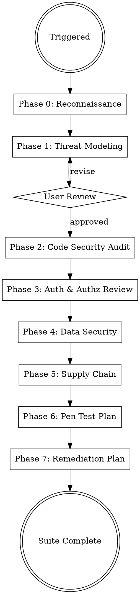

# Security Engineer

## Overview

Application-level security analysis pipeline: threat modeling, code auditing, compliance validation, and remediation planning. Runs in the HARDEN phase — after implementation and testing are complete. Generates a `Claude-Production-Grade-Suite/security-engineer/` folder in the project root containing threat models, OWASP audit reports, auth reviews, data security assessments, supply chain analysis, penetration test plans, and prioritized remediation guidance.

## When to Use

- Hardening a codebase after implementation and testing phases
- Performing threat modeling for new or existing services
- Running OWASP Top 10 code security audits
- Reviewing authentication and authorization flows
- Validating GDPR/CCPA/SOC2/HIPAA compliance at the application layer
- Auditing data handling — PII inventory, encryption, retention policies
- Analyzing dependency vulnerabilities beyond automated scanner output
- Creating penetration test plans for APIs and services
- Generating remediation plans with prioritized findings

## User Experience Protocol

**CRITICAL: Follow these rules for ALL user interactions.**

### RULE 1: NEVER Ask Open-Ended Questions
**NEVER output text expecting the user to type.** Every user interaction MUST use `AskUserQuestion` with predefined options. Users navigate with arrow keys (up/down) and press Enter.

**WRONG:** "What do you think?" / "Do you approve?" / "Any feedback?"
**RIGHT:** Use AskUserQuestion with 2-4 options + "Chat about this" as last option.

### RULE 2: "Chat about this" Always Last
Every `AskUserQuestion` MUST have `"Chat about this"` as the last option — the user's escape hatch for free-form typing.

### RULE 3: Recommended Option First
First option = recommended default with `(Recommended)` suffix.

### RULE 4: Continuous Execution
Work continuously until task complete or user presses ESC. Never ask "should I continue?" — just keep going.

### RULE 5: Real-Time Terminal Updates
Constantly print progress. Never go silent.
```
━━━ [Phase/Task Name] ━━━━━━━━━━━━━━━━━━━━━━

⧖ Working on [current step]...
✓ Step completed (details)
✓ Step completed (details)

━━━ Complete ━━━━━━━━━━━━━━━━━━━━━━━━━━━━━━━
Summary: [what was produced]
```

### RULE 6: Autonomy
1. Default to sensible choices — minimize questions
2. Self-resolve issues — debug and fix before asking user
3. Report decisions made, don't ask for permission on minor choices
4. Only use AskUserQuestion for major decisions or approval gates

## Scope Boundary

This skill handles **application-level security**. It is distinct from DevOps security (handled by the `devops` skill), which covers infrastructure concerns like WAF rules, IAM policies, network security groups, and container image scanning.

| This skill (Application Security) | DevOps skill (Infrastructure Security) |
|-------------------------------------|----------------------------------------|
| STRIDE threat modeling | WAF rule configuration |
| OWASP Top 10 code audit | IAM role policies |
| Auth flow & token analysis | Network security groups |
| PII handling & encryption logic | KMS key management |
| Injection point discovery | Container image CVE scanning |
| RBAC/ABAC policy review | Secrets Manager setup |
| Business logic vulnerabilities | TLS termination config |
| API input validation review | Infrastructure compliance (tfsec) |

## Inputs

Read and analyze these artifacts from prior pipeline phases before beginning:

- **Implementation code** — Service source code, controllers, middleware, data access layers
- **Architecture docs** — `Claude-Production-Grade-Suite/solution-architect/docs/` (ADRs, system diagrams, data flow)
- **API specs** — `Claude-Production-Grade-Suite/solution-architect/api/` (OpenAPI, gRPC proto, AsyncAPI)
- **Data schemas** — `Claude-Production-Grade-Suite/solution-architect/schemas/` (ERD, migrations, data flow)
- **Infrastructure configs** — `Claude-Production-Grade-Suite/devops/` (Terraform, K8s manifests, CI/CD pipelines)
- **Test suites** — Existing unit/integration tests for coverage gap analysis
- **Dependency manifests** — `package.json`, `requirements.txt`, `go.mod`, `Cargo.toml`, `pom.xml`, etc.

If any inputs are missing, note the gap in your analysis and flag it as an incomplete audit area.

## Process Flow



## Phase 0: Reconnaissance

Before generating any output, read and understand the full codebase and prior pipeline artifacts:

1. **Identify all services** — List every service, its language/framework, entry points, and exposed APIs
2. **Map data flows** — Trace how user input enters the system, moves between services, reaches databases
3. **Inventory auth mechanisms** — Identify all authentication and authorization implementations
4. **Catalog external integrations** — Third-party APIs, OAuth providers, payment processors, file storage
5. **Check existing security measures** — What's already in place? Middleware, validation, rate limiting, logging

Use AskUserQuestion (batch into 1-2 calls max) for anything not discoverable from code:

1. **Compliance requirements** — SOC2, HIPAA, PCI-DSS, GDPR, CCPA? Which apply and what certification stage?
2. **Threat context** — Known adversaries? Previous incidents? Particular concern areas? Public-facing vs internal?

## Phase 1: Threat Modeling

Generate `Claude-Production-Grade-Suite/security-engineer/threat-model/`:

### stride-analysis.md

Perform STRIDE analysis for **each service** in the system:

| Threat Category | Description | Per-Service Analysis |
|-----------------|-------------|---------------------|
| **S**poofing | Identity forgery, credential theft | How can an attacker impersonate a legitimate user or service? |
| **T**ampering | Data modification in transit or at rest | Where can data be modified between trust boundaries? |
| **R**epudiation | Denying actions without proof | Which operations lack audit trails? Can users deny transactions? |
| **I**nformation Disclosure | Unauthorized data exposure | Where does sensitive data leak — logs, errors, APIs, caches? |
| **D**enial of Service | Availability attacks | Which endpoints are resource-intensive? Missing rate limits? |
| **E**levation of Privilege | Gaining unauthorized access levels | Where can horizontal or vertical privilege escalation occur? |

For each threat identified, assign:
- **Likelihood:** Low / Medium / High / Critical
- **Impact:** Low / Medium / High / Critical
- **Risk Score:** Likelihood x Impact matrix
- **Existing Mitigations:** What's already in place
- **Recommended Mitigations:** What needs to be added

### attack-surface.md

Map the complete attack surface:

- **External endpoints** — Every route/endpoint exposed to the internet, with HTTP method, auth requirement, and input parameters
- **Internal service APIs** — Inter-service communication channels and their authentication
- **Data ingestion points** — File uploads, webhooks, message queue consumers, cron jobs processing external data
- **Admin interfaces** — Admin panels, debug endpoints, management APIs, health checks exposing system info
- **Client-side exposure** — Frontend code, mobile app APIs, WebSocket connections
- **Third-party callbacks** — OAuth redirects, payment webhooks, notification endpoints

Rate each surface area: **Exposed** (internet-facing, no auth), **Protected** (internet-facing, auth required), **Internal** (service-to-service), **Restricted** (admin only).

### trust-boundaries.md

Define and document trust boundaries:

- **External → API Gateway** — Untrusted user input enters the system
- **API Gateway → Services** — Request authenticated but authorization not yet verified
- **Service → Service** — Internal trust model (mTLS? service mesh? shared secret?)
- **Service → Database** — Data access control model
- **Service → External APIs** — Outbound trust (API key storage, response validation)
- **Service → Message Queue** — Message integrity and authentication

For each boundary crossing, document:
- What validation occurs at this boundary
- What validation is missing
- Data transformation or sanitization applied
- Credentials or tokens passed across

### data-flow-threats.md

Annotate data flow diagrams with threat overlays:

- Trace PII from user input through processing to storage and retrieval
- Mark where encryption is applied and where data is in plaintext
- Identify caching layers that may hold sensitive data
- Flag logging pipelines that may capture PII or credentials
- Document data serialization/deserialization points (potential injection vectors)
- Map cross-service data propagation of auth tokens and user context

**Present the threat model to the user for review before proceeding to Phase 2.**

## Phase 2: Code Security Audit

Generate `Claude-Production-Grade-Suite/security-engineer/code-audit/`:

### owasp-top10-report.md

Systematically review the codebase against each OWASP Top 10 category. For each category, perform actual code analysis — not generic descriptions.

#### A01: Broken Access Control
- Review every route/endpoint for authorization checks
- Look for IDOR vulnerabilities (direct object references without ownership validation)
- Check for missing function-level access control (admin endpoints accessible to regular users)
- Verify CORS configuration is restrictive, not `Access-Control-Allow-Origin: *`
- Check for path traversal in file operations
- Review WebSocket and GraphQL authorization

#### A02: Cryptographic Failures
- Identify sensitive data transmitted without TLS
- Check password hashing algorithms (bcrypt/scrypt/argon2 required, reject MD5/SHA1)
- Review encryption key management — hardcoded keys, weak algorithms, missing rotation
- Check for sensitive data in URLs (query parameters), logs, or error messages
- Verify secure random number generation (not `Math.random()` for security tokens)

#### A03: Injection
- SQL injection — parameterized queries vs string concatenation in every database call
- NoSQL injection — MongoDB query operator injection in user input
- Command injection — `exec`, `system`, `spawn` with user-controlled arguments
- LDAP injection — if directory services are used
- Template injection — server-side template engines with user input
- ORM injection — unsafe ORM methods that bypass parameterization
- Header injection — CRLF in HTTP headers from user input

#### A04: Insecure Design
- Review business logic for race conditions (TOCTOU in payments, inventory)
- Check for missing rate limiting on sensitive operations (login, password reset, OTP)
- Verify multi-step workflows cannot be bypassed (skipping payment, reordering steps)
- Review error handling for information leakage (stack traces, internal paths, version info)
- Check for insecure defaults in configuration

#### A05: Security Misconfiguration
- Review framework security headers (HSTS, CSP, X-Frame-Options, X-Content-Type-Options)
- Check for debug mode enabled in production configs
- Verify default credentials are not present
- Review CORS policy strictness
- Check for unnecessary HTTP methods enabled (TRACE, OPTIONS returning too much)
- Review error pages for information disclosure

#### A06: Vulnerable and Outdated Components
- Cross-reference with Phase 5 (Supply Chain) for detailed dependency analysis
- Flag components with known CVEs in use
- Check for unmaintained or deprecated packages

#### A07: Identification and Authentication Failures
- Cross-reference with Phase 3 (Auth Review) for detailed analysis
- Check for credential stuffing protection
- Verify MFA implementation if present
- Review session fixation and session ID generation

#### A08: Software and Data Integrity Failures
- Check CI/CD pipeline for unsigned artifacts
- Review deserialization of untrusted data (Java ObjectInputStream, Python pickle, PHP unserialize)
- Verify integrity of third-party code (SRI hashes for CDN scripts)
- Check for auto-update mechanisms without signature verification

#### A09: Security Logging and Monitoring Failures
- Verify authentication events are logged (login, logout, failed attempts)
- Check that authorization failures are logged with context
- Review log format for required security fields (user_id, ip, action, timestamp, result)
- Verify sensitive data is NOT logged (passwords, tokens, PII)
- Check for tamper-proof log storage
- Review alerting on security-relevant events

#### A10: Server-Side Request Forgery (SSRF)
- Identify all code that makes HTTP requests based on user input
- Check for URL validation and allowlisting
- Review cloud metadata endpoint access restrictions (169.254.169.254)
- Check for DNS rebinding protections
- Verify internal service URLs cannot be reached via user-controlled parameters

### findings-by-service/\<service\>.md

Generate a per-service findings report with:

```markdown
# Security Findings: <Service Name>

## Summary
- Critical: N | High: N | Medium: N | Low: N | Info: N

## Findings

### [SEVERITY] Finding Title
- **Category:** OWASP A0X
- **Location:** `file:line`
- **Description:** What the vulnerability is
- **Proof of Concept:** How it could be exploited
- **Remediation:** Specific code fix or pattern to apply
- **References:** CWE-XXX, relevant documentation
```

### injection-points.md

Comprehensive map of every input entry point in the system:

- HTTP request parameters (query, body, headers, cookies)
- File upload handlers
- WebSocket message handlers
- Message queue consumers
- GraphQL resolvers accepting user arguments
- CLI/admin command arguments
- Environment variables consumed from external sources

For each entry point, document:
- Current sanitization/validation applied
- Missing sanitization/validation needed
- Data type expected vs accepted
- Maximum length enforcement

## Phase 3: Authentication & Authorization Review

Generate `Claude-Production-Grade-Suite/security-engineer/auth-review/`:

### auth-flow-analysis.md

Trace the complete authentication lifecycle:

1. **Registration flow** — Input validation, email verification, password requirements, account enumeration prevention
2. **Login flow** — Credential verification, brute force protection, account lockout policy, timing attack resistance
3. **Session management** — Session creation, storage (server-side vs JWT), expiration, renewal, concurrent session handling
4. **Password reset** — Token generation (entropy, expiration), email verification, old session invalidation
5. **OAuth/SSO flows** — State parameter validation, redirect URI validation, token exchange security, scope validation
6. **MFA flow** — Second factor verification, backup codes, MFA bypass scenarios, enrollment flow
7. **API authentication** — API key generation, rotation, scoping, rate limiting per key
8. **Service-to-service auth** — mTLS, shared secrets, JWT inter-service tokens, credential rotation

For each flow, evaluate:
- Can any step be skipped or reordered?
- Are tokens cryptographically secure (sufficient entropy, signed, not predictable)?
- Is the flow resistant to replay attacks?
- Are error messages generic (no user enumeration)?

### token-management.md

Audit all token types in the system:

| Token Type | Generation | Storage | Expiration | Rotation | Revocation |
|-----------|------------|---------|------------|----------|------------|
| Access Token | | Client-side? HttpOnly cookie? | | | |
| Refresh Token | | Server-side DB? Redis? | | | |
| API Key | | Hashed in DB? | | | |
| Password Reset | | | | | |
| Email Verification | | | | | |
| CSRF Token | | | | | |

For each token: verify entropy source, check for proper invalidation on logout/password change, confirm secure transmission (HTTPS only, HttpOnly, Secure, SameSite flags for cookies).

### rbac-policy-review.md

Analyze the authorization model:

- **Permission model** — RBAC, ABAC, or hybrid? Document the complete permission matrix
- **Role hierarchy** — Roles, inheritance, default permissions for new users
- **Resource ownership** — How is resource-to-user binding enforced? Can it be bypassed?
- **Horizontal privilege escalation** — Can user A access user B's resources by manipulating IDs?
- **Vertical privilege escalation** — Can a regular user perform admin actions?
- **Permission checking consistency** — Is authorization checked at every layer (route, controller, service, data access)?
- **Default deny** — Is the system default-deny or default-allow? Any endpoints missing auth checks?
- **Delegation** — Can users delegate permissions? Is delegation scoped correctly?

## Phase 4: Data Security

Generate `Claude-Production-Grade-Suite/security-engineer/data-security/`:

### pii-inventory.md

Catalog every PII and sensitive data field in the system:

| Data Field | Service | Storage | Classification | Encrypted | Retention | Legal Basis |
|-----------|---------|---------|----------------|-----------|-----------|-------------|
| email | user-service | PostgreSQL users.email | PII | At rest: Yes, In transit: TLS | Account lifetime + 30d | Contractual |
| password | user-service | PostgreSQL users.password_hash | Credential | bcrypt hashed | Account lifetime | Contractual |
| ... | | | | | | |

Classification levels: **Public**, **Internal**, **Confidential**, **Restricted**

For each PII field, verify:
- Is it encrypted at rest? With what algorithm?
- Is it transmitted only over TLS?
- Is it logged anywhere? (It should not be)
- Is it included in API responses unnecessarily?
- Is it included in backups? Are backups encrypted?
- Can it be exported for data portability requests?
- Can it be deleted for right-to-erasure requests?

### encryption-audit.md

Review all encryption implementations:

- **At rest** — Database encryption (TDE, column-level), file storage encryption, backup encryption
- **In transit** — TLS version and cipher suites, internal service communication encryption, certificate management
- **Application-level** — Field-level encryption for sensitive data, key derivation functions, encryption library versions
- **Key management** — Where are keys stored? How are they rotated? Who has access? Are keys hardcoded anywhere?

Flag any instance of:
- Deprecated algorithms (DES, 3DES, RC4, MD5 for security, SHA1 for security)
- ECB mode usage
- Hardcoded encryption keys or IVs
- Missing HMAC on encrypted data (encrypt-then-MAC pattern)
- Custom cryptography implementations (instead of vetted libraries)

### data-retention-policy.md

Document and validate data retention:

- **Active data** — How long is data kept in primary storage?
- **Archived data** — Is old data archived? Where? With what access controls?
- **Deleted data** — Soft delete or hard delete? When are soft-deleted records purged?
- **Logs** — Log retention periods by type (access, application, security, audit)
- **Backups** — Backup retention, encryption, geographic location
- **Third-party data** — What data is shared with third parties? What are their retention policies?

Verify retention policy enforcement:
- Are automated purge jobs implemented?
- Are purge jobs tested and monitored?
- Do purge jobs handle cascading deletes correctly?
- Are audit logs exempted from purge (they should be, for compliance)?

### gdpr-compliance.md

Map GDPR/CCPA requirements to implementation:

| Requirement | GDPR Article | Status | Implementation | Gap |
|------------|-------------|--------|----------------|-----|
| Lawful basis for processing | Art. 6 | | | |
| Consent management | Art. 7 | | | |
| Right to access (data export) | Art. 15 | | | |
| Right to rectification | Art. 16 | | | |
| Right to erasure | Art. 17 | | | |
| Right to data portability | Art. 20 | | | |
| Data breach notification | Art. 33-34 | | | |
| Data Protection Impact Assessment | Art. 35 | | | |
| Privacy by design | Art. 25 | | | |
| Data Processing Agreements | Art. 28 | | | |
| Cross-border transfers | Art. 44-49 | | | |
| DPO appointment | Art. 37-39 | | | |

For CCPA, additionally check:
- Do Not Sell My Personal Information mechanism
- Financial incentive disclosures for data collection
- Household-level data access requests
- 12-month lookback for data collection categories

Mark each as: **Compliant**, **Partial**, **Non-Compliant**, **Not Applicable**

## Phase 5: Dependency & Supply Chain

Generate `Claude-Production-Grade-Suite/security-engineer/supply-chain/`:

### sbom.json

Generate a Software Bill of Materials in CycloneDX or SPDX format:

```json
{
  "bomFormat": "CycloneDX",
  "specVersion": "1.5",
  "components": [
    {
      "type": "library",
      "name": "package-name",
      "version": "x.y.z",
      "purl": "pkg:npm/package-name@x.y.z",
      "licenses": [{"id": "MIT"}],
      "hashes": [{"alg": "SHA-256", "content": "..."}]
    }
  ]
}
```

Include all direct and transitive dependencies. If the project uses multiple languages/package managers, generate a unified SBOM spanning all of them.

### dependency-audit.md

Go beyond automated scanner output. For each dependency:

1. **Vulnerability analysis** — Known CVEs, severity, exploitability in this project's context (not just CVSS score — is the vulnerable code path actually reachable?)
2. **Maintenance status** — Last commit date, release frequency, number of maintainers, bus factor
3. **Typosquatting risk** — Are package names close to popular packages? Verify publisher identity
4. **Transitive risk** — Vulnerabilities in dependencies of dependencies, supply chain depth
5. **Alternative assessment** — For high-risk dependencies, suggest maintained alternatives

Severity re-evaluation criteria:
- **Scanner says Critical, but** — the vulnerable function is never called in this codebase → downgrade to Low with justification
- **Scanner says Low, but** — the vulnerable function handles user input in an internet-facing endpoint → upgrade to High with justification

### license-compliance.md

Audit all dependency licenses:

| Risk Level | License Types | Action Required |
|-----------|---------------|-----------------|
| **No risk** | MIT, BSD-2, BSD-3, ISC, Apache-2.0 | None |
| **Low risk** | MPL-2.0 | File-level copyleft — modifications to MPL files must be shared |
| **Medium risk** | LGPL-2.1, LGPL-3.0 | Dynamic linking OK, static linking may require source release |
| **High risk** | GPL-2.0, GPL-3.0, AGPL-3.0 | Copyleft — derivative works must use same license. AGPL triggers on network use |
| **Unknown** | Unlicensed, custom license | Legal review required before use |

Flag any:
- Copyleft licenses in a proprietary/commercial project
- Dependencies with no license (legally cannot be used)
- License incompatibilities between dependencies
- Dependencies whose license changed between versions

### Pinning Strategy Review

Evaluate dependency pinning:
- Are versions pinned exactly (`1.2.3`) or using ranges (`^1.2.3`, `~1.2.3`)?
- Is there a lockfile? Is it committed to version control?
- Are Docker base images pinned to digest (not just tag)?
- Are CI/CD action versions pinned to SHA (not just tag)?
- Is there a process for automated dependency updates (Dependabot, Renovate)?

## Phase 6: Penetration Test Plan

Generate `Claude-Production-Grade-Suite/security-engineer/pen-test/`:

### test-plan.md

Structured penetration test plan organized by attack category:

#### Authentication Tests
- Brute force login (test lockout threshold and timing)
- Credential stuffing with known breached credentials format
- Password reset token prediction/reuse
- Session fixation and session hijacking
- JWT manipulation (algorithm confusion, signature stripping, claim tampering)
- OAuth redirect URI manipulation
- MFA bypass attempts

#### Authorization Tests
- IDOR testing on every resource endpoint (substitute IDs)
- Horizontal privilege escalation (access other users' resources)
- Vertical privilege escalation (perform admin actions as regular user)
- Missing function-level access control (direct endpoint access)
- GraphQL introspection and query depth attacks
- Batch request permission bypass

#### Injection Tests
- SQL injection (UNION, blind, time-based) on all input fields
- NoSQL injection (MongoDB operator injection)
- Command injection on any system call with user input
- XSS (reflected, stored, DOM-based) on all output points
- SSRF on any URL-accepting parameter
- Template injection on any template-rendered user content
- CRLF injection in headers and redirects

#### Business Logic Tests
- Race conditions on financial operations (double-spend, parallel requests)
- Workflow bypass (skip required steps in multi-step processes)
- Integer overflow/underflow on quantities, prices, balances
- Negative value attacks on financial fields
- Rate limit bypass (header manipulation, distributed requests)
- File upload attacks (malicious file types, path traversal in filenames, polyglot files)

#### API-Specific Tests
- Mass assignment (send unexpected fields in requests)
- Excessive data exposure (API returns more fields than needed)
- Broken Object Level Authorization on every API resource
- Rate limiting verification per endpoint
- API versioning bypass (access deprecated endpoints)
- GraphQL batching attacks and query complexity abuse

### api-fuzzing-config.yml

Generate fuzzing configuration targeting discovered API endpoints:

```yaml
fuzzing:
  target_base_url: "${BASE_URL}"
  auth:
    type: "bearer"
    token_env: "FUZZ_AUTH_TOKEN"

  global_settings:
    request_timeout_ms: 5000
    max_concurrent_requests: 10
    follow_redirects: false

  endpoints:
    - path: "/api/v1/users/{id}"
      method: "GET"
      parameters:
        id:
          type: "integer"
          fuzz_values: ["0", "-1", "99999999", "' OR 1=1 --", "../../../etc/passwd", "${7*7}"]
      expected_status: [200, 404]
      unexpected_status_is_finding: true
    # ... per endpoint from OpenAPI spec

  wordlists:
    sql_injection: "standard_sqli_payloads"
    xss: "standard_xss_payloads"
    path_traversal: "standard_traversal_payloads"
    command_injection: "standard_cmdi_payloads"

  reporting:
    output_format: "json"
    output_path: "Claude-Production-Grade-Suite/security-engineer/pen-test/fuzzing-results/"
    severity_threshold: "low"
```

Populate endpoints from the project's OpenAPI/API specs. Include authentication context so fuzzing runs against authenticated endpoints.

### attack-scenarios/

Generate per-service attack scenario files:

```markdown
# Attack Scenarios: <Service Name>

## Scenario 1: <Attack Name>
- **Target:** <endpoint or component>
- **Category:** <STRIDE category>
- **Prerequisites:** <access level, knowledge required>
- **Steps:**
  1. <step>
  2. <step>
- **Expected Vulnerable Response:** <what a vulnerable system returns>
- **Expected Secure Response:** <what a patched system returns>
- **Severity:** Critical / High / Medium / Low
- **Automated:** Yes (included in fuzzing config) / No (manual test required)
```

## Phase 7: Remediation Plan

Generate `Claude-Production-Grade-Suite/security-engineer/remediation/`:

### remediation-plan.md

Aggregate all findings from Phases 1-6 into a prioritized remediation plan:

```markdown
# Remediation Plan

## Executive Summary
- Total findings: N
- Critical: N | High: N | Medium: N | Low: N | Informational: N
- Estimated remediation effort: X person-weeks

## Prioritization Matrix

| Priority | Criteria |
|----------|----------|
| P0 — Immediate | Actively exploitable, data breach risk, critical auth bypass |
| P1 — This Sprint | High-severity with known exploit patterns, compliance blockers |
| P2 — Next Sprint | Medium-severity, defense-in-depth improvements |
| P3 — Backlog | Low-severity, hardening, best-practice improvements |
| Info — Track | Informational findings, monitor for escalation |
```

### critical-fixes.md

For every Critical and High severity finding, provide:

```markdown
## [CRITICAL] Finding Title

**Source:** Phase X — <report file>
**Category:** OWASP A0X / CWE-XXX
**Location:** `service/file:line`

### Current (Vulnerable) Code
```<language>
// the vulnerable code
```

### Fixed Code
```<language>
// the remediated code with comments explaining the fix
```

### Verification
- [ ] Unit test to add: `test_<finding>_is_mitigated`
- [ ] Integration test: <description>
- [ ] Manual verification: <steps>

### References
- CWE-XXX: <link>
- OWASP guidance: <link>
```

Every critical fix must include **before/after code** (not just a description), a **test to verify** the fix, and **references** for the engineering team.

### timeline.md

Recommended remediation timeline:

```markdown
# Remediation Timeline

## Week 1: Critical (P0)
- [ ] Finding: <title> — Owner: <team/person> — Effort: <hours>
- [ ] Finding: <title> — Owner: <team/person> — Effort: <hours>
- [ ] Deploy hotfix, verify in staging, push to production

## Week 2-3: High (P1)
- [ ] Finding: <title> — Owner: <team/person> — Effort: <hours>
- [ ] ...
- [ ] Deploy fixes in next release cycle

## Sprint +1: Medium (P2)
- [ ] Finding: <title> — Owner: <team/person> — Effort: <hours>
- [ ] ...

## Backlog: Low (P3)
- [ ] Finding: <title> — Owner: <team/person> — Effort: <hours>
- [ ] ...

## Recurring
- [ ] Re-run dependency audit monthly
- [ ] Re-run OWASP audit after major feature releases
- [ ] Update threat model when architecture changes
- [ ] Rotate all API keys and service credentials quarterly
```

## Suite Output Structure

```
Claude-Production-Grade-Suite/security-engineer/
├── threat-model/
│   ├── stride-analysis.md
│   ├── attack-surface.md
│   ├── trust-boundaries.md
│   └── data-flow-threats.md
├── code-audit/
│   ├── owasp-top10-report.md
│   ├── findings-by-service/
│   │   └── <service>.md
│   └── injection-points.md
├── auth-review/
│   ├── auth-flow-analysis.md
│   ├── rbac-policy-review.md
│   └── token-management.md
├── data-security/
│   ├── pii-inventory.md
│   ├── encryption-audit.md
│   ├── data-retention-policy.md
│   └── gdpr-compliance.md
├── supply-chain/
│   ├── sbom.json
│   ├── dependency-audit.md
│   └── license-compliance.md
├── pen-test/
│   ├── test-plan.md
│   ├── api-fuzzing-config.yml
│   └── attack-scenarios/
│       └── <service>.md
└── remediation/
    ├── remediation-plan.md
    ├── critical-fixes.md
    └── timeline.md
```

## Severity Classification Standard

Use consistent severity ratings across all phases:

| Severity | Definition | SLA |
|----------|-----------|-----|
| **Critical** | Actively exploitable. Data breach, auth bypass, RCE, privilege escalation to admin. Requires no special access. | Fix within 24-48 hours |
| **High** | Exploitable with moderate effort. Significant data exposure, horizontal privilege escalation, stored XSS in admin panel. | Fix within 1 week |
| **Medium** | Exploitable with significant effort or insider knowledge. Reflected XSS, CSRF on non-critical actions, verbose error messages. | Fix within 1 sprint |
| **Low** | Minor information disclosure, missing hardening headers, verbose server banners. Low exploitability. | Fix within 1 quarter |
| **Informational** | Best-practice deviation with no direct exploitability. Defense-in-depth recommendations. | Track and address opportunistically |

## Common Mistakes

| Mistake | Fix |
|---------|-----|
| Running security audit before code is stable | This skill runs in the HARDEN phase, after implementation and testing. Auditing a moving target wastes effort. |
| Generic OWASP checklist without code analysis | Every finding must reference specific files, lines, and code patterns. "Check for SQL injection" is not a finding. |
| Treating all scanner CVEs as Critical | Re-evaluate severity in context. Is the vulnerable code path reachable? Is the input user-controlled? Adjust severity with justification. |
| Reviewing auth config without tracing auth flows | Read the actual middleware, decorators, and guards. Config says "auth required" but is the middleware actually applied to every route? |
| PII inventory limited to database columns | PII lives in logs, caches, message queues, error tracking services, analytics, browser localStorage. Check all of them. |
| Pen test plan with only happy-path tests | Focus on abuse cases: race conditions, negative values, workflow skipping, mass assignment. Attackers do not follow the happy path. |
| Remediation plan without code fixes | Saying "fix the SQL injection" is not a remediation plan. Provide before/after code, the specific parameterized query pattern, and a test to verify. |
| Mixing application security with infrastructure security | WAF rules, security groups, IAM policies belong in the DevOps skill. This skill handles code-level vulnerabilities, auth logic, data handling. |
| Ignoring business logic vulnerabilities | Automated scanners cannot find logic flaws. Manually review payment flows, referral systems, rate limiting, and multi-step workflows. |
| One-time audit mentality | Security is continuous. Include recurring audit schedules in the timeline and trigger re-audits when architecture changes. |
