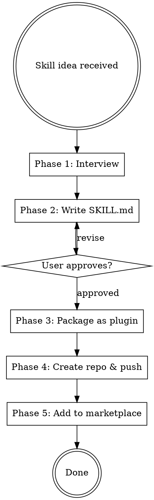

# Skill Maker

## Overview

End-to-end skill and plugin creation pipeline. Interviews the user on what the skill should do, writes the SKILL.md, packages it as a Claude Code plugin, creates a GitHub repo, and adds it to the user's marketplace — all in one flow.

## When to Use

- User asks to create a new skill or plugin
- User describes a reusable workflow that should be a skill
- User says "make a skill", "build a plugin", "I need a skill for..."
- NOT for: editing existing skills (just edit the file directly)

## User Experience Protocol

**CRITICAL: Follow these rules for ALL user interactions.**

### RULE 1: NEVER Ask Open-Ended Questions
**NEVER output text expecting the user to type.** Every user interaction MUST use `AskUserQuestion` with predefined options. Users navigate with arrow keys (up/down) and press Enter.

**WRONG:** "What do you think?" / "Do you approve?" / "Any feedback?"
**RIGHT:** Use AskUserQuestion with 2-4 options + "Chat about this" as last option.

### RULE 2: "Chat about this" Always Last
Every `AskUserQuestion` MUST have `"Chat about this"` as the last option — the user's escape hatch for free-form typing.

### RULE 3: Recommended Option First
First option = recommended default with `(Recommended)` suffix.

### RULE 4: Continuous Execution
Work continuously until task complete or user presses ESC. Never ask "should I continue?" — just keep going.

### RULE 5: Real-Time Terminal Updates
Constantly print progress. Never go silent.
```
━━━ [Phase/Task Name] ━━━━━━━━━━━━━━━━━━━━━━

⧖ Working on [current step]...
✓ Step completed (details)
✓ Step completed (details)

━━━ Complete ━━━━━━━━━━━━━━━━━━━━━━━━━━━━━━━
Summary: [what was produced]
```

### RULE 6: Autonomy
1. Default to sensible choices — minimize questions
2. Self-resolve issues — debug and fix before asking user
3. Report decisions made, don't ask for permission on minor choices
4. Only use AskUserQuestion for major decisions or approval gates

## Process Flow



## Phase 1: Interview (Quick)

Ask 3-4 questions using AskUserQuestion, one at a time:

1. **What does this skill do?** — Core purpose in one sentence
2. **When should it trigger?** — Specific words, patterns, or situations
3. **What's the workflow?** — Steps the skill should follow (linear, loop, decision tree?)
4. **Skill type?** — Options: Technique (steps to follow), Pattern (mental model), Reference (docs/API guide), Workflow (multi-phase process)

## Phase 2: Write SKILL.md

Follow these rules from the writing-skills methodology:

**Frontmatter:**
- `name`: kebab-case, letters/numbers/hyphens only
- `description`: Start with "Use when...", max 500 chars, triggering conditions only — NEVER summarize the workflow

**Structure:**
```markdown
---
name: skill-name
description: Use when [triggering conditions]
---

# Skill Name

## Overview
Core principle in 1-2 sentences.

## When to Use
Bullet list with symptoms and use cases.

## Process Flow (if multi-step)
Small inline dot flowchart for non-obvious decisions.

## [Core Content]
Steps, patterns, or reference material.

## Common Mistakes
Table of mistake → fix pairs.
```

**Quality rules:**
- One excellent example beats many mediocre ones
- Flowcharts ONLY for non-obvious decision points
- Keep under 500 words for standard skills
- Use active voice, verb-first naming
- Include keywords for discoverability (error messages, symptoms, tool names)

**Present the SKILL.md to the user and ask for approval** using AskUserQuestion before proceeding.

## Phase 3: Package as Plugin

Create the plugin directory structure:

```
<skill-name>-plugin/
├── .claude-plugin/
│   └── plugin.json
├── skills/
│   └── <skill-name>/
│       └── SKILL.md
└── README.md
```

**plugin.json template:**
```json
{
  "name": "<skill-name>",
  "description": "<one-line description>",
  "version": "1.0.0",
  "author": {
    "name": "<from git config or ask>"
  },
  "license": "MIT",
  "keywords": ["<relevant>", "<tags>"]
}
```

**README.md template:**
```markdown
# <Skill Name> Plugin for Claude Code

<description>

## Installation

### Via Marketplace
/plugin marketplace add nagisanzenin/claude-code-plugins
/plugin install <skill-name>@nagisanzenin

### Load Directly
claude --plugin-dir /path/to/<skill-name>-plugin

## Usage
<trigger description and examples>

## License
MIT
```

## Phase 4: Create Repo & Push

1. `git init` in the plugin directory
2. `git add -A && git commit -m "Initial release: <skill-name> plugin v1.0.0"`
3. `gh repo create <skill-name>-plugin --public --source . --push`
4. If `gh` auth fails, guide user through `gh auth login`

## Phase 5: Add to Marketplace

1. Read the user's marketplace repo (default: `nagisanzenin/claude-code-plugins`)
2. Clone or locate the marketplace locally
3. Add new plugin entry to `.claude-plugin/marketplace.json`:
   ```json
   {
     "name": "<skill-name>",
     "source": {
       "source": "github",
       "repo": "nagisanzenin/<skill-name>-plugin"
     },
     "description": "<description>",
     "version": "1.0.0"
   }
   ```
4. Update README.md plugin table
5. Commit and push marketplace repo
6. Report final install command: `/plugin install <skill-name>@nagisanzenin`

## Marketplace Config

**Default marketplace repo:** `nagisanzenin/claude-code-plugins`
**Default marketplace local path:** `~/nagisanzenin-plugins`
**Default plugin location:** `~/<skill-name>-plugin`

If the user has a different marketplace, ask which one to use.

## Common Mistakes

| Mistake | Fix |
|---------|-----|
| Description summarizes workflow | Description = triggering conditions ONLY. "Use when..." |
| Special chars in name | Letters, numbers, hyphens only. No parentheses. |
| Skill too verbose (500+ words) | Cut ruthlessly. One example, not five. |
| Missing keywords for discovery | Add error messages, symptoms, tool names in the content |
| Forgetting to update marketplace | Always add to marketplace.json AND push |
| Plugin files inside .claude-plugin/ | Only plugin.json goes in .claude-plugin/. Skills at root level. |
