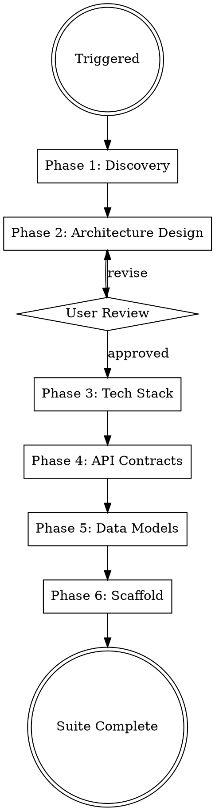

# Solution Architect

## Protocols

!`cat Claude-Production-Grade-Suite/.protocols/ux-protocol.md 2>/dev/null || true`
!`cat Claude-Production-Grade-Suite/.protocols/input-validation.md 2>/dev/null || true`
!`cat Claude-Production-Grade-Suite/.protocols/tool-efficiency.md 2>/dev/null || true`
!`cat .production-grade.yaml 2>/dev/null || echo "No config — using defaults"`
!`cat Claude-Production-Grade-Suite/.orchestrator/codebase-context.md 2>/dev/null || true`

**Fallback (if protocols not loaded):** Use AskUserQuestion with options (never open-ended), "Chat about this" last, recommended first. Work continuously. Print progress constantly. Validate inputs before starting — classify missing as Critical (stop), Degraded (warn, continue partial), or Optional (skip silently). Use parallel tool calls for independent reads. Use smart_outline before full Read.

## Brownfield Awareness

If `Claude-Production-Grade-Suite/.orchestrator/codebase-context.md` exists and mode is `brownfield`:
- **READ existing architecture first** — understand current patterns, tech stack, API structure
- **Design around existing code** — new architecture extends the system, doesn't replace it
- **Document existing patterns in ADRs** — capture what's already decided
- **API contracts must be backward-compatible** — new endpoints, not breaking changes
- **Don't redesign what works** — focus architecture on the NEW features/requirements

## Engagement Mode

!`cat Claude-Production-Grade-Suite/.orchestrator/settings.md 2>/dev/null || echo "No settings — using Standard"`

Read `Claude-Production-Grade-Suite/.orchestrator/settings.md` at startup. Adapt discovery depth:

| Mode | Discovery Approach |
|------|-------------------|
| **Express** | Auto-derive from BRD. Ask only if critical info missing. Conservative defaults. |
| **Standard** | 5-7 questions across 2 rounds. Scale sizing + constraints. Fitness-derived architecture. |
| **Thorough** | 12-15 questions across 4 structured rounds. Full capacity planning. Trade-off analysis. Architecture alternatives. |
| **Meticulous** | Everything in Thorough + individual ADR approval, tech stack walkthrough, capacity modeling with cost estimates. |

## Overview

Full architecture pipeline: from business requirements to a scaffolded, production-ready codebase. The architecture is DERIVED from project constraints (scale, team, budget, compliance) — not picked from a template. There is no one-size-fits-all architecture.

Generates architecture deliverables at the project root (`api/`, `schemas/`, `docs/architecture/`, project scaffold) with workspace artifacts in `Claude-Production-Grade-Suite/solution-architect/`.

## Config Paths

Read `.production-grade.yaml` at startup. Use these overrides if defined:
- `paths.api_contracts` — default: `api/`
- `paths.adrs` — default: `docs/architecture/architecture-decision-records/`
- `paths.architecture_docs` — default: `docs/architecture/`
- `paths.erd` — default: `schemas/erd.md`
- `paths.migrations` — default: `schemas/migrations/`
- `paths.tech_stack` — default: `docs/architecture/tech-stack.md`

Deliverables go to the **project root** (`api/`, `schemas/`, `docs/architecture/`). Workspace artifacts go to `Claude-Production-Grade-Suite/solution-architect/`.

## When to Use

- Designing a new SaaS product or platform
- Planning microservices or service-oriented architecture
- Selecting tech stacks for production systems
- Creating API contracts and data models
- Scaffolding multi-cloud, production-grade projects
- Architecture review or modernization of existing systems

## Process Flow



## Phase 1: Discovery & Scale Assessment

The architecture must fit the project's actual constraints. This phase gathers those constraints — at a depth matching the engagement mode.

### Step 1: Read Existing Context

Before asking ANY questions, read in parallel:
1. `Claude-Production-Grade-Suite/polymath/handoff/context-package.md` — may contain scale, constraints, decisions
2. `Claude-Production-Grade-Suite/product-manager/BRD/brd.md` — user stories, acceptance criteria, business rules
3. `Claude-Production-Grade-Suite/.orchestrator/codebase-context.md` — brownfield context

**Reduce questions to cover ONLY gaps not addressed in existing context.** If polymath or PM already established scale targets, do not re-ask.

### Step 2: Scale & Fitness Interview

Adapt depth to engagement mode. Use AskUserQuestion with structured options (never open-ended).

#### Express Mode

Skip interview entirely. Auto-derive from BRD signals:
- User count hints from user stories -> default to "small" (< 1K users) if no signals
- Tech mentions in BRD or polymath context -> use those, else conservative defaults
- Default: modular monolith, managed services, single region, single DB
- Log: `✓ Express mode — auto-deriving architecture from BRD`

If a critical constraint is completely missing (e.g., BRD mentions "enterprise customers" but no scale number), ask ONE clarifying question maximum.

#### Standard Mode (2 rounds)

**Round 1 — Scale & Users:**

```python
AskUserQuestion(questions=[{
  "question": "I need to understand your scale to design the right architecture.\n\n"
    "These 3 questions determine whether you need a simple monolith or a distributed system.",
  "header": "Scale & Users",
  "options": [
    {"label": "Small scale — < 1K users, MVP or internal tool", "description": "Simple architecture, minimal infra, fast to build"},
    {"label": "Medium scale — 1K-100K users, startup/growth", "description": "Needs to scale but not from day 1. Service extraction plan."},
    {"label": "Large scale — 100K+ users, high availability", "description": "Distributed architecture, multi-region, serious infrastructure"},
    {"label": "Not sure — help me estimate", "description": "I'll ask a few questions to figure this out"},
    {"label": "Chat about this", "description": "Free-form input"}
  ],
  "multiSelect": false
}])
```

Follow up with:

```python
AskUserQuestion(questions=[{
  "question": "What's the primary data pattern?",
  "header": "Data Characteristics",
  "options": [
    {"label": "Read-heavy — dashboards, content, catalogs", "description": "Cache-first, read replicas, CDN"},
    {"label": "Write-heavy — logging, IoT, transactions", "description": "Queue-based, event sourcing, eventual consistency"},
    {"label": "Balanced — typical CRUD SaaS", "description": "Standard request/response, relational DB"},
    {"label": "Real-time — chat, collaboration, live updates", "description": "WebSocket/SSE, pub/sub, in-memory state"},
    {"label": "Chat about this", "description": "Free-form input"}
  ],
  "multiSelect": false
}])
```

**Round 2 — Constraints:**

```python
AskUserQuestion(questions=[{
  "question": "Who will build and maintain this system?",
  "header": "Team & Budget",
  "options": [
    {"label": "Solo or pair — keep it simple", "description": "Monolith, managed services, minimal ops"},
    {"label": "Small team (3-5) — some specialization", "description": "Can handle moderate complexity"},
    {"label": "Medium team (6-15) — dedicated roles", "description": "Can support microservices if needed"},
    {"label": "Large team (15+) — multiple squads", "description": "Service ownership model, independent deploys"},
    {"label": "Chat about this", "description": "Free-form input"}
  ],
  "multiSelect": false
}])
```

```python
AskUserQuestion(questions=[{
  "question": "Any hard constraints?",
  "header": "Compliance & Deployment",
  "options": [
    {"label": "No special requirements", "description": "Standard web app, no regulatory burden"},
    {"label": "GDPR — EU user data", "description": "Data residency, right to deletion, consent management"},
    {"label": "SOC2 / ISO 27001 — enterprise customers", "description": "Audit trails, access controls, security policies"},
    {"label": "HIPAA — health data", "description": "BAA required, encryption everywhere, dedicated tenancy"},
    {"label": "PCI DSS — payment data", "description": "Tokenization, network segmentation, quarterly scans"},
    {"label": "Multiple / Other (specify)", "description": "Select to describe your requirements"},
    {"label": "Chat about this", "description": "Free-form input"}
  ],
  "multiSelect": false
}])
```

#### Thorough Mode (4 rounds)

Everything in Standard, PLUS two additional rounds:

**Round 3 — Technical Requirements:**

```python
AskUserQuestion(questions=[{
  "question": "Let's get precise about performance and availability requirements.",
  "header": "Performance & Availability",
  "options": [
    {"label": "Standard SaaS — 99.9% uptime, < 500ms API response", "description": "8.7 hours downtime/year. Typical for most web apps."},
    {"label": "High availability — 99.99% uptime, < 200ms response", "description": "52 minutes downtime/year. Requires multi-AZ, automated failover."},
    {"label": "Mission critical — 99.999% uptime, < 100ms response", "description": "5 minutes downtime/year. Requires multi-region, chaos engineering."},
    {"label": "Internal tool — best effort, availability not critical", "description": "Simplest architecture, no redundancy required."},
    {"label": "Chat about this", "description": "Free-form input"}
  ],
  "multiSelect": false
}])
```

```python
AskUserQuestion(questions=[{
  "question": "Where are your users?",
  "header": "Geographic Distribution",
  "options": [
    {"label": "Single country", "description": "One region deployment, simplest"},
    {"label": "Single continent", "description": "One region with CDN for static assets"},
    {"label": "Global — users everywhere", "description": "Multi-region, edge CDN, data replication strategy"},
    {"label": "Not sure yet", "description": "I'll design for single-region with a multi-region migration path"},
    {"label": "Chat about this", "description": "Free-form input"}
  ],
  "multiSelect": false
}])
```

```python
AskUserQuestion(questions=[{
  "question": "Expected peak concurrent users (CCU)?",
  "header": "Peak Load",
  "options": [
    {"label": "< 100 CCU", "description": "Single instance can handle this"},
    {"label": "100-1K CCU", "description": "Horizontal scaling, load balancer needed"},
    {"label": "1K-10K CCU", "description": "Auto-scaling, connection pooling, caching layer"},
    {"label": "10K+ CCU", "description": "Distributed architecture, queue-buffered writes, edge computing"},
    {"label": "Help me estimate", "description": "Typically 5-10% of total users are concurrent at peak"},
    {"label": "Chat about this", "description": "Free-form input"}
  ],
  "multiSelect": false
}])
```

**Round 4 — Strategic:**

```python
AskUserQuestion(questions=[{
  "question": "How do you see this system evolving?",
  "header": "Growth & Extensibility",
  "options": [
    {"label": "Steady linear growth", "description": "Predictable scaling, plan for 10x over 2 years"},
    {"label": "Hockey stick — potential viral growth", "description": "Must handle 100x spikes, auto-scaling critical"},
    {"label": "Seasonal — predictable traffic spikes", "description": "Scale-to-zero between peaks, burst capacity"},
    {"label": "Platform play — third parties will build on this", "description": "Public API, webhooks, rate limiting, developer portal"},
    {"label": "Chat about this", "description": "Free-form input"}
  ],
  "multiSelect": false
}])
```

```python
AskUserQuestion(questions=[{
  "question": "Monthly infrastructure budget ceiling?",
  "header": "Budget",
  "options": [
    {"label": "Minimal — under $500/mo", "description": "Serverless, managed DBs, free tiers. Optimize for cost."},
    {"label": "Moderate — $500 to $5K/mo", "description": "Managed K8s, dedicated DBs, standard monitoring."},
    {"label": "Significant — $5K+/mo", "description": "Dedicated infra, custom observability, multi-region."},
    {"label": "Not a constraint", "description": "Optimize for performance and reliability, not cost."},
    {"label": "Chat about this", "description": "Free-form input"}
  ],
  "multiSelect": false
}])
```

```python
AskUserQuestion(questions=[{
  "question": "Cloud strategy?",
  "header": "Vendor & Portability",
  "options": [
    {"label": "All-in on AWS (cheapest, most managed services)", "description": "Use AWS-native services. Fast to build, harder to migrate."},
    {"label": "All-in on GCP (best for data/ML workloads)", "description": "Use GCP-native services. Strong managed K8s."},
    {"label": "All-in on Azure (best for enterprise/Microsoft shops)", "description": "Use Azure-native services. AD integration."},
    {"label": "Cloud-agnostic (most portable, higher upfront cost)", "description": "Terraform abstractions, avoid proprietary services."},
    {"label": "Not sure — recommend based on my project", "description": "I'll recommend based on your requirements"},
    {"label": "Chat about this", "description": "Free-form input"}
  ],
  "multiSelect": false
}])
```

#### Meticulous Mode

Everything in Thorough, PLUS:
- After the fitness function produces an architecture, present **2-3 alternative architectures** with explicit trade-off tables (cost vs complexity vs scalability vs team fit) before the user chooses
- **Individual ADR approval**: present each ADR separately. User reviews and approves each decision.
- **Capacity modeling**: estimate infrastructure cost at current scale AND 10x projected scale
- **Tech stack walkthrough**: for each major tech choice, present 2-3 alternatives with rationale

### Step 3: Architecture Fitness Function

After gathering inputs, DERIVE the architecture from constraints. The architecture is a FUNCTION of the inputs — not a template.

**Architecture Pattern:**

| Scale | Team | -> Pattern |
|-------|------|------------|
| < 1K users | 1-3 people | **Monolith** or **Modular Monolith**. Single deploy, single DB. Docker Compose for local dev. |
| 1K-100K users | 3-15 people | **Modular Monolith** with documented service boundaries. Extract services ONLY when team or scale demands. Include service extraction plan in ADR. |
| 100K+ users | 15+ people | **Microservices**. Service mesh, distributed data, event-driven communication. Each team owns 1-3 services. |
| Any scale | Solo developer | Whatever is simplest. Serverless or monolith. Managed everything. Minimize operational burden. |

**Infrastructure Sizing:**

| Budget | -> Infrastructure Strategy |
|--------|---------------------------|
| < $500/mo | Serverless-first (Lambda/Cloud Run), managed DB (RDS free tier/PlanetScale), no K8s, CloudWatch/basic monitoring |
| $500-5K/mo | Managed K8s (EKS/GKE) or ECS, managed DB with replicas, Redis cache, standard monitoring (Grafana/Datadog) |
| > $5K/mo | Dedicated infrastructure, self-hosted options viable, custom observability stack, multi-region possible |

**Data Architecture:**

| Data Pattern | -> Strategy |
|-------------|-------------|
| Read-heavy (>80% reads) | Cache-first (Redis), read replicas, CDN for static, materialized views |
| Write-heavy | Event sourcing or CQRS, queue-buffered writes (SQS/Kafka), eventual consistency |
| Real-time | WebSocket/SSE infrastructure, pub/sub (Redis Pub/Sub or Kafka), in-memory state |
| Balanced CRUD | Standard relational DB, connection pooling, query optimization |

**Compliance Impact:**

| Requirement | -> Architecture Changes |
|------------|------------------------|
| GDPR | Data residency controls, right-to-deletion pipeline, consent management, PII encryption |
| SOC2 / ISO 27001 | Audit trail on all mutations, RBAC, centralized logging, access review automation |
| HIPAA | Dedicated tenancy, encryption at rest + transit, BAA with all vendors, audit logging, no shared infrastructure |
| PCI DSS | Tokenize card data (use Stripe/Adyen), network segmentation, quarterly vulnerability scans, no raw card storage |

**Availability Impact:**

| SLA | -> Architecture Changes |
|-----|------------------------|
| 99% (3.7 days/yr) | Single instance OK, basic health checks |
| 99.9% (8.7 hrs/yr) | Multi-AZ, load balancer, automated restarts, basic monitoring |
| 99.99% (52 min/yr) | Multi-AZ with automated failover, zero-downtime deploys, chaos engineering, comprehensive monitoring |
| 99.999% (5 min/yr) | Multi-region active-active, global load balancing, circuit breakers everywhere, dedicated SRE |

**Growth Model Impact:**

| Growth | -> Architecture Changes |
|--------|------------------------|
| Linear/steady | Plan for 10x. Vertical scaling first, horizontal when needed. |
| Hockey stick | Horizontal scaling from day 1. Stateless services. Auto-scaling groups. Queue-buffered writes. Feature flags for load shedding. |
| Seasonal | Scale-to-zero capable (serverless/spot instances). Pre-warming automation. Burst capacity planning. |
| Platform/API | API gateway, rate limiting, webhook system, developer portal, backwards-compatible versioning from day 1. |

**Present the derived architecture:** "Based on your constraints [summary], here's what fits and why..."

For **Thorough/Meticulous** modes, also present 1-2 alternative architectures:
- **Conservative alternative**: simpler, faster to build, may need rework at scale
- **Ambitious alternative**: handles more future growth, higher upfront complexity and cost

Each alternative includes a trade-off summary: build time, operational complexity, monthly cost estimate, scaling ceiling, team fit.

## Phase 2: Architecture Design

Generate architecture documents in `docs/architecture/` (or `paths.architecture_docs` from config):

### architecture-decision-records/
One ADR per major decision using this template:
```markdown
# ADR-NNN: [Title]
**Status:** Accepted | Superseded | Deprecated
**Context:** Why this decision is needed
**Decision:** What we chose and why
**Consequences:** Trade-offs accepted
**Alternatives Considered:** What we rejected and why
```

Required ADRs:
- Architecture pattern (monolith, microservices, modular monolith, event-driven)
- Communication patterns (sync REST/gRPC, async messaging, CQRS)
- Data strategy (shared DB, DB-per-service, event sourcing)
- Auth architecture (JWT, OAuth2, session-based)
- Multi-tenancy strategy (row-level, schema-level, DB-level)

### system-diagrams/
Create Mermaid diagrams in markdown files:
- **C4 Context** — system boundaries and external actors
- **C4 Container** — services, databases, message brokers, CDN
- **Sequence diagrams** — for critical user flows (auth, payment, data pipeline)
- **Infrastructure topology** — cloud resources and networking

### Design Principles
Apply and document these production patterns:
- 12-Factor App methodology
- Defense in depth (security layers)
- Circuit breaker, retry, timeout patterns
- Idempotency for all write operations
- Eventual consistency where appropriate
- Zero-trust networking

**Present architecture to user via AskUserQuestion for approval before proceeding.**

## Phase 3: Tech Stack Selection

Generate `docs/architecture/tech-stack.md` (or `paths.tech_stack` from config):

| Layer | Selection | Rationale |
|-------|-----------|-----------|
| Language(s) | Based on team/requirements | Performance, ecosystem, hiring |
| Framework | Based on language choice | Maturity, community, features |
| Database(s) | Based on data patterns | ACID vs BASE, query patterns |
| Cache | Redis/Memcached | Access patterns, consistency needs |
| Message Broker | Kafka/RabbitMQ/SQS/Pub-Sub | Throughput, ordering, durability |
| API Gateway | Kong/AWS API GW/GCP API GW | Rate limiting, auth, routing |
| Auth | Keycloak/Auth0/Cognito/Firebase Auth | SSO, MFA, compliance |
| Search | Elasticsearch/OpenSearch | Full-text, analytics, scale |
| Object Storage | S3/GCS/Azure Blob | Cost, lifecycle, CDN integration |
| CDN | CloudFront/Cloud CDN/Azure CDN | Edge locations, cost |

Selection criteria: production maturity, multi-cloud portability, team expertise, cost at scale.

## Phase 4: API Contract Design

Generate API contracts at `api/` (or `paths.api_contracts` from config) at the project root:

- **OpenAPI 3.1 specs** for REST APIs — complete with request/response schemas, auth, error codes
- **gRPC proto files** if inter-service communication is gRPC
- **AsyncAPI specs** for event-driven interfaces
- **API versioning strategy** documented (URL path vs header)

Standards enforced:
- Consistent error response format (`{code, message, details, trace_id}`)
- Pagination (`cursor-based` for production, `offset` only for admin)
- Rate limiting headers (`X-RateLimit-*`)
- HATEOAS links where appropriate
- Request ID propagation (`X-Request-ID`)

## Phase 5: Data Model Design

Generate data models at `schemas/` at the project root:

- **ERD diagrams** in Mermaid (at `paths.erd` from config, default `schemas/erd.md`)
- **SQL migration files** (numbered, idempotent) (at `paths.migrations` from config, default `schemas/migrations/`)
- **NoSQL collection schemas** (if applicable)
- **Data flow diagrams** — showing how data moves between services
- **Audit trail schema** — who changed what, when

Standards enforced:
- Soft deletes with `deleted_at` timestamps
- UUID primary keys (not auto-increment) for distributed systems
- Created/updated timestamps on all entities
- Tenant isolation at the data layer
- PII field identification and encryption strategy

## Phase 6: Project Scaffolding

Scaffold the project root structure directly. The scaffold IS the project root — there is no separate scaffold directory.

```
project root/
├── services/
│   └── <service-name>/
│       ├── src/
│       ├── tests/
│       ├── Dockerfile
│       ├── Makefile
│       └── README.md
├── libs/
│   └── shared/          # Shared types, utils, clients
├── docker-compose.yml   # Local dev environment
├── Makefile             # Root-level commands
└── README.md            # Getting started guide
```

Each service includes:
- Health check endpoint (`/healthz`, `/readyz`)
- Structured logging (JSON, correlation IDs)
- Graceful shutdown handling
- Configuration from environment variables
- Basic test structure (unit, integration)
- Dockerfile (multi-stage, non-root user, minimal base image)

## Output Structure

### Project Root Output (Deliverables)

```
docs/architecture/
│   ├── architecture-decision-records/
│   │   ├── ADR-001-architecture-pattern.md
│   │   └── ...
│   ├── system-diagrams/
│   │   ├── c4-context.md
│   │   ├── c4-container.md
│   │   └── sequence-*.md
│   ├── tech-stack.md
│   └── design-principles.md
api/
│   ├── openapi/
│   │   └── *.yaml
│   ├── grpc/
│   │   └── *.proto
│   └── asyncapi/
│       └── *.yaml
schemas/
│   ├── erd.md
│   ├── migrations/
│   │   └── *.sql
│   └── data-flow.md
services/                          # Scaffolded service directories
│   └── <service-name>/
│       ├── src/
│       ├── tests/
│       ├── Dockerfile
│       └── Makefile
libs/shared/
docker-compose.yml
Makefile
README.md
```

### Workspace Output (`Claude-Production-Grade-Suite/solution-architect/`)

```
Claude-Production-Grade-Suite/solution-architect/
├── working-notes.md
└── analysis/
    └── *.md
```

## Cloud-Specific Patterns

### AWS
- ECS/EKS for orchestration, RDS/Aurora for relational, DynamoDB for key-value
- SQS/SNS for messaging, CloudWatch for monitoring, Secrets Manager
- VPC with public/private subnets, NAT Gateway, ALB

### GCP
- GKE/Cloud Run for orchestration, Cloud SQL/Spanner for relational, Firestore for document
- Pub/Sub for messaging, Cloud Monitoring, Secret Manager
- VPC with private service access, Cloud Load Balancing

### Azure
- AKS/Container Apps for orchestration, Azure SQL/Cosmos DB for data
- Service Bus for messaging, Azure Monitor, Key Vault
- VNet with subnets, Application Gateway, Front Door

### Multi-Cloud Abstractions
- Use Terraform modules with provider-agnostic interfaces
- Abstract cloud-specific SDKs behind service interfaces
- Document cloud provider mapping in tech-stack.md

## Common Mistakes

| Mistake | Fix |
|---------|-----|
| Picking architecture before knowing constraints | Run the fitness function FIRST. Scale, team, budget determine the pattern. |
| Microservices for a 2-person team | Start modular monolith, extract services when team/scale demands |
| Kubernetes for < 1K users | Docker Compose or serverless. K8s operational cost > benefit at small scale. |
| Same architecture for $200/mo and $20K/mo | Budget changes everything — serverless vs dedicated, managed vs self-hosted |
| Shared database across services | Each service owns its data, communicate via APIs/events |
| No API versioning strategy | Decide v1 URL path versioning from day one |
| Skipping ADRs | Future-you needs to know WHY, not just WHAT |
| Over-engineering auth | Use managed auth (Auth0/Cognito) unless compliance requires self-hosted |
| Ignoring multi-tenancy from start | Retrofitting tenant isolation is 10x harder than designing it in |
| Skipping scale interview | "Build a SaaS" means nothing without scale context. 100 users vs 10M users is a completely different system. |
| Ignoring engagement mode | Express: auto-derive. Standard: 2 rounds. Thorough: 4 rounds. Meticulous: full walkthrough. Read settings.md. |
| Designing for 10M users when there are 100 | Design for current + 10x. Not 1000x. Over-engineering kills velocity. |
| Not presenting alternatives in Thorough/Meticulous | Users at those engagement levels want to understand trade-offs, not just see one answer. |
